# Yantrika-

# Sanskrit Programming Language - Developer Documentation

[](https://github.com/Yantrika-Programming-language/Yantrika)
[](LICENSE)
[](RELEASES)
[](CONTRIBUTING.md)

## Table of Contents

1. [Project Overview](#project-overview)
2. [Getting Started](#getting-started)
3. [Development Environment Setup](#development-environment-setup)
4. [Architecture & Design](#architecture--design)
5. [Contributing Guidelines](#contributing-guidelines)
6. [Code Standards](#code-standards)
7. [Testing Framework](#testing-framework)
8. [Build System](#build-system)
9. [API Documentation](#api-documentation)
10. [Language Specification](#language-specification)
11. [Examples & Tutorials](#examples--tutorials)
12. [Release Process](#release-process)
13. [Community & Support](#community--support)

---

## Project Overview

### Vision

**संस्कृत** (Sanskrit) is a modern programming language that bridges ancient wisdom with contemporary computing. Our goal is to create a language that:

- Preserves and promotes Sanskrit linguistic heritage
- Provides a robust, type-safe programming environment
- Maintains compatibility with modern development practices
- Serves as an educational tool for both programming and Sanskrit

### Key Features

- **देवनागरी Support**: Native Devanagari script with Unicode compliance
- **Strong Type System**: Inspired by Sanskrit grammatical precision
- **Modern Paradigms**: Object-oriented, functional, and procedural programming
- **Standard Library**: Comprehensive library using Sanskrit terminology
- **Interoperability**: C/C++ FFI for existing code integration
- **Cross-Platform**: Supports Linux, macOS, Windows

### Project Status

- **Current Version**: 0.1.0-alpha
- **Language**: Subset implementation in progress
- **Compiler**: Basic lexer, parser, and code generator functional
- **Standard Library**: Core functions implemented
- **Documentation**: Active development

---

## Getting Started

### Prerequisites

#### System Requirements

- **OS**: Linux (Ubuntu 20.04+), macOS (10.15+), Windows (WSL2 recommended)
- **RAM**: Minimum 4GB, Recommended 8GB
- **Storage**: 2GB free space for development tools

#### Required Software

```bash
# Ubuntu/Debian
sudo apt update
sudo apt install build-essential cmake git
sudo apt install libicu-dev libunistring-dev
sudo apt install valgrind gdb

# macOS
brew install cmake git icu4c
brew install --cask visual-studio-code

# Install Nix (cross-platform, optional but recommended)
curl -L https://nixos.org/nix/install | sh
```

### Quick Installation

#### From Source

```bash
# Clone the repository
git clone https://github.com/Yantrika-Programming-language/Yantrika.git
cd sanskrit-compiler

# Build the compiler
make build

# Install system-wide (optional)
sudo make install

# Verify installation
sanskrit --version
```

#### Using Package Managers

```bash
# Homebrew (macOS)
brew install sanskrit-lang/tap/sanskrit

# Snap (Linux)
sudo snap install sanskrit --edge

# Scoop (Windows)
scoop bucket add sanskrit-lang https://github.com/sanskrit-lang/scoop-bucket
scoop install sanskrit
```

### First Program

Create a file named `प्रथम.संस्` (first.sans):

```sanskrit
// प्रथम कार्यक्रम - First Program
कार्य मुख्य() -> शून्य {
    मुद्रण("नमस्ते संसार!");  // Print "Hello World!"
}
```

Compile and run:

```bash
sanskrit प्रथम.संस् -o प्रथम
./प्रथम
```

---

## Development Environment Setup

### Repository Structure

```
sanskrit-compiler/
├── 📁 src/                     # Source code
│   ├── 📁 lexer/              # Lexical analysis
│   ├── 📁 parser/             # Syntax analysis  
│   ├── 📁 semantic/           # Semantic analysis
│   ├── 📁 codegen/            # Code generation
│   ├── 📁 runtime/            # Runtime system
│   └── 📁 stdlib/             # Standard library
├── 📁 include/                # Header files
├── 📁 tests/                  # Test suite
│   ├── 📁 unit/              # Unit tests
│   ├── 📁 integration/       # Integration tests
│   └── 📁 benchmark/         # Performance tests
├── 📁 docs/                   # Documentation
│   ├── 📁 spec/              # Language specification
│   ├── 📁 examples/          # Code examples
│   └── 📁 api/               # API documentation
├── 📁 tools/                  # Development tools
│   ├── 📁 debugger/          # Sanskrit debugger
│   ├── 📁 formatter/         # Code formatter
│   └── 📁 lsp/               # Language server
├── 📁 scripts/                # Build and utility scripts
├── 📁 pkg/                    # Package distributions
├── 📄 CMakeLists.txt          # CMake configuration
├── 📄 Makefile                # GNU Make wrapper
├── 📄 .github/                # GitHub workflows
└── 📄 README.md               # Project README
```

### Development Tools

#### IDE Setup

##### Visual Studio Code

1. Install the Sanskrit extension:
   ```bash
   code --install-extension sanskrit-lang.sanskrit-support
   ```

2. Configure settings (`.vscode/settings.json`):
   ```json
   {
     "sanskrit.compiler.path": "/usr/local/bin/sanskrit",
     "sanskrit.lsp.enabled": true,
     "sanskrit.format.onSave": true,
     "files.associations": {
       "*.संस्": "sanskrit",
       "*.sans": "sanskrit"
     }
   }
   ```

##### Vim/Neovim

```vim
" Add to ~/.vimrc or ~/.config/nvim/init.vim
Plug 'sanskrit-lang/vim-sanskrit'

" Configuration
let g:sanskrit_compiler = '/usr/local/bin/sanskrit'
let g:sanskrit_format_on_save = 1
```

##### Emacs

```elisp
;; Add to ~/.emacs or ~/.emacs.d/init.el
(use-package sanskrit-mode
  :ensure t
  :mode ("\\.संस्\\'" "\\.sans\\'")
  :config
  (setq sanskrit-compiler-command "sanskrit"))
```

#### Build Configuration

##### CMake Setup

```cmake
# CMakeLists.txt
cmake_minimum_required(VERSION 3.16)
project(sanskrit-compiler VERSION 0.1.0 LANGUAGES C CXX)

set(CMAKE_C_STANDARD 11)
set(CMAKE_CXX_STANDARD 17)

# Find dependencies
find_package(PkgConfig REQUIRED)
pkg_check_modules(ICU REQUIRED icu-uc icu-io)

# Compiler options
if(CMAKE_BUILD_TYPE STREQUAL "Debug")
    add_compile_options(-g -O0 -fsanitize=address)
    add_link_options(-fsanitize=address)
endif()

# Include directories
include_directories(include)
include_directories(${ICU_INCLUDE_DIRS})

# Main executable
add_executable(sanskrit
    src/main.c
    src/lexer/scanner.c
    src/parser/parser.c
    src/semantic/analyzer.c
    src/codegen/generator.c
    src/runtime/runtime.c
)

target_link_libraries(sanskrit ${ICU_LIBRARIES})

# Tests
enable_testing()
add_subdirectory(tests)
```

##### Nix Flake (Recommended)

```nix
# flake.nix
{
  description = "Sanskrit Programming Language";

  inputs = {
    nixpkgs.url = "github:NixOS/nixpkgs/nixos-unstable";
    flake-utils.url = "github:numtide/flake-utils";
  };

  outputs = { self, nixpkgs, flake-utils }:
    flake-utils.lib.eachDefaultSystem (system:
      let
        pkgs = nixpkgs.legacyPackages.${system};
      in
      {
        devShells.default = pkgs.mkShell {
          buildInputs = with pkgs; [
            cmake
            gcc
            gdb
            valgrind
            pkg-config
            icu
            libunistring
            doxygen
            clang-tools
          ];

          shellHook = ''
            echo "Sanskrit development environment loaded"
            export SANSKRIT_DEV=1
          '';
        };

        packages.default = pkgs.stdenv.mkDerivation {
          pname = "sanskrit-compiler";
          version = "0.1.0";
          src = ./.;
          
          buildInputs = with pkgs; [ cmake icu ];
          
          buildPhase = ''
            cmake .
            make
          '';
          
          installPhase = ''
            mkdir -p $out/bin
            cp sanskrit $out/bin/
          '';
        };
      });
}
```

### Environment Variables

```bash
# Add to ~/.bashrc or ~/.zshrc
export SANSKRIT_HOME="/path/to/sanskrit-compiler"
export SANSKRIT_LIB_PATH="$SANSKRIT_HOME/stdlib"
export PATH="$SANSKRIT_HOME/bin:$PATH"

# Development settings
export SANSKRIT_DEBUG=1
export SANSKRIT_LOG_LEVEL=debug
```

---

## Architecture & Design

### Compiler Pipeline

```mermaid
graph TD
    A["Source Code<br/>(.संस्)"] --> B[Scanner]
    B --> C[Lexer]
    C --> D[Parser]
    D --> E[AST]
    E --> F[Semantic Analyzer]
    F --> G[Symbol Table]
    G --> H[Type Checker]
    H --> I[IR Generator]
    I --> J[Optimizer]
    J --> K[Code Generator]
    K --> L[Assembler]
    L --> M[Linker]
    M --> N[Executable]
```



### Core Components

#### 1. Scanner & Lexer

**Purpose**: Convert source code into tokens

**Key Files**:
- `src/lexer/scanner.h` - Scanner interface
- `src/lexer/scanner.c` - Scanner implementation
- `src/lexer/tokens.h` - Token definitions
- `src/lexer/unicode.c` - Unicode/Devanagari handling

**Key Functions**:
```c
// Scanner initialization
Scanner* scanner_init(const char* source);

// Token scanning
Token* scanner_next_token(Scanner* scanner);

// Unicode utilities
bool is_devanagari_letter(uint32_t codepoint);
int utf8_char_length(const char* str);
```

#### 2. Parser

**Purpose**: Build Abstract Syntax Tree from tokens

**Key Files**:
- `src/parser/parser.h` - Parser interface
- `src/parser/parser.c` - Recursive descent parser
- `src/parser/ast.h` - AST node definitions
- `src/parser/grammar.bnf` - Language grammar

**Key Functions**:
```c
// Parser initialization
Parser* parser_init(Scanner* scanner);

// Parse program
ASTNode* parser_parse_program(Parser* parser);

// AST utilities
void ast_print(ASTNode* node, int indent);
void ast_free(ASTNode* node);
```

#### 3. Semantic Analyzer

**Purpose**: Type checking and symbol resolution

**Key Files**:
- `src/semantic/analyzer.h` - Semantic analyzer interface
- `src/semantic/analyzer.c` - Semantic analysis implementation
- `src/semantic/symbol_table.h` - Symbol table
- `src/semantic/types.h` - Type system

**Key Functions**:
```c
// Semantic analysis
bool semantic_analyze(ASTNode* program, ErrorList* errors);

// Symbol table operations
SymbolTable* symbol_table_create(void);
Symbol* symbol_table_lookup(SymbolTable* table, const char* name);

// Type checking
Type* type_check_expression(ASTNode* expr, SymbolTable* table);
```

#### 4. Code Generator

**Purpose**: Generate target code (assembly/LLVM IR)

**Key Files**:
- `src/codegen/generator.h` - Code generator interface
- `src/codegen/x86_64.c` - x86-64 backend
- `src/codegen/llvm.c` - LLVM backend
- `src/codegen/tac.h` - Three-address code

**Key Functions**:
```c
// Code generation
CodeGenerator* codegen_create(CodegenTarget target);
void codegen_generate(CodeGenerator* gen, ASTNode* program);

// Target-specific
void codegen_x86_64_init(CodeGenerator* gen);
void codegen_llvm_init(CodeGenerator* gen);
```

### Memory Management

#### RAII Pattern

```c
// Example: Scanner lifecycle
typedef struct Scanner {
    char* source;
    char* current;
    int line;
    int column;
    // ... other fields
} Scanner;

Scanner* scanner_create(const char* source) {
    Scanner* scanner = malloc(sizeof(Scanner));
    if (!scanner) return NULL;
    
    scanner->source = strdup(source);
    scanner->current = scanner->source;
    scanner->line = 1;
    scanner->column = 1;
    
    return scanner;
}

void scanner_destroy(Scanner* scanner) {
    if (scanner) {
        free(scanner->source);
        free(scanner);
    }
}
```

#### Arena Allocator

```c
// For temporary allocations during compilation
typedef struct Arena {
    char* memory;
    size_t size;
    size_t used;
} Arena;

Arena* arena_create(size_t size);
void* arena_alloc(Arena* arena, size_t size);
void arena_destroy(Arena* arena);
```

### Error Handling

#### Error Types

```c
typedef enum {
    ERROR_LEXICAL,
    ERROR_SYNTAX,
    ERROR_SEMANTIC,
    ERROR_TYPE,
    ERROR_RUNTIME,
    ERROR_SYSTEM
} ErrorType;

typedef struct Error {
    ErrorType type;
    int line;
    int column;
    char* message;
    char* source_line;
    struct Error* next;
} Error;

typedef struct ErrorList {
    Error* head;
    Error* tail;
    int count;
} ErrorList;
```

#### Error Reporting

```c
// Error creation
Error* error_create(ErrorType type, int line, int column, const char* fmt, ...);

// Error list management
void error_list_add(ErrorList* list, Error* error);
void error_list_print(ErrorList* list, FILE* output);
void error_list_free(ErrorList* list);

// Error recovery
void parser_synchronize(Parser* parser);
```

---

## Contributing Guidelines

### Getting Started

1. **Fork the Repository**
   ```bash
   # Fork on GitHub, then clone your fork
   git clone https://github.com/YOUR_USERNAME/sanskrit-compiler.git
   cd sanskrit-compiler
   
   # Add upstream remote
   git remote add upstream https://github.com/Yantrika-Programming-language/Yantrika.git
   ```

2. **Set Up Development Environment**
   ```bash
   # Using Nix (recommended)
   nix develop
   
   # Or using system packages
   ./scripts/setup-dev.sh
   ```

3. **Create a Feature Branch**
   ```bash
   git checkout -b feature/your-feature-name
   ```

### Contribution Areas

#### 🔤 **Language Features**
- New syntax constructs
- Control flow statements
- Data types
- Operators

#### 🏗️ **Compiler Infrastructure**
- Optimization passes
- New backends (ARM, WASM)
- Error recovery
- Performance improvements

#### 📚 **Standard Library**
- Core functions
- Mathematical operations
- String manipulation
- I/O operations

#### 🛠️ **Tooling**
- IDE integrations
- Debugger enhancements
- Formatter improvements
- Package manager

#### 📖 **Documentation**
- Language tutorials
- API documentation
- Architecture guides
- Examples

### Pull Request Process

1. **Pre-submission Checklist**
   - [ ] Code follows style guidelines
   - [ ] Tests pass (`make test`)
   - [ ] Documentation updated
   - [ ] CHANGELOG.md updated
   - [ ] No memory leaks (valgrind clean)

2. **Pull Request Template**
   ```markdown
   ## Description
   Brief description of changes
   
   ## Type of Change
   - [ ] Bug fix
   - [ ] New feature
   - [ ] Breaking change
   - [ ] Documentation update
   
   ## Testing
   - [ ] Unit tests pass
   - [ ] Integration tests pass
   - [ ] Manual testing completed
   
   ## Related Issues
   Closes #issue_number
   ```

3. **Review Process**
   - Automated checks (CI/CD)
   - Code review by maintainers
   - Testing on multiple platforms
   - Documentation review

### Issue Guidelines

#### Bug Reports

```markdown
**Bug Description**
Clear description of the bug

**Steps to Reproduce**
1. Step one
2. Step two
3. ...

**Expected Behavior**
What should happen

**Actual Behavior**
What actually happens

**Environment**
- OS: [e.g., Ubuntu 22.04]
- Sanskrit version: [e.g., 0.1.0]
- Compiler: [e.g., GCC 11.2]

**Additional Context**
Any other relevant information
```

#### Feature Requests

```markdown
**Feature Description**
Clear description of proposed feature

**Motivation**
Why is this feature needed?

**Proposed Implementation**
High-level implementation approach

**Alternatives Considered**
Other solutions you've considered

**Additional Context**
Any other relevant information
```

---

## Code Standards

### C Coding Style

#### General Principles

1. **Clarity over cleverness**
2. **Consistent naming conventions**
3. **Minimal but sufficient comments**
4. **Error handling at all levels**

#### Naming Conventions

```c
// Functions: snake_case with module prefix
int scanner_get_token(Scanner* scanner);
void parser_free_ast(ASTNode* node);

// Types: PascalCase
typedef struct Scanner Scanner;
typedef enum TokenType TokenType;

// Constants: UPPER_SNAKE_CASE
#define MAX_IDENTIFIER_LENGTH 256
#define DEFAULT_BUFFER_SIZE 1024

// Variables: snake_case
int current_line;
char* identifier_name;

// Macros: UPPER_SNAKE_CASE
#define ARRAY_SIZE(arr) (sizeof(arr) / sizeof((arr)[0]))
```

#### Code Formatting

```c
// Function definition
ReturnType function_name(ParameterType param1, 
                        ParameterType param2) {
    // Implementation
}

// Control structures
if (condition) {
    // Single statement or block
} else if (other_condition) {
    // Another block
} else {
    // Default block
}

// Switch statements
switch (value) {
    case CONSTANT1:
        // Code
        break;
    case CONSTANT2:
        // Code
        break;
    default:
        // Default case
        break;
}

// Long function calls
result = very_long_function_name(parameter1,
                                parameter2,
                                parameter3);
```

#### Header Files

```c
// scanner.h
#ifndef SANSKRIT_SCANNER_H
#define SANSKRIT_SCANNER_H

#include <stdint.h>
#include <stdbool.h>

// Forward declarations
typedef struct Scanner Scanner;
typedef struct Token Token;

// Public API
Scanner* scanner_create(const char* source);
void scanner_destroy(Scanner* scanner);
Token* scanner_next_token(Scanner* scanner);

#endif // SANSKRIT_SCANNER_H
```

#### Documentation

```c
/**
 * @brief Scans the next token from the source
 * 
 * This function advances the scanner position and returns
 * the next token in the source code. It handles Unicode
 * characters and Devanagari script correctly.
 * 
 * @param scanner The scanner instance
 * @return Pointer to the next token, or NULL on error
 * 
 * @note The returned token must be freed by the caller
 * @see token_free()
 */
Token* scanner_next_token(Scanner* scanner);
```

### Sanskrit Coding Style

#### Script Guidelines

```sanskrit
// File header comment
/**
 * फाइल: गणित.संस्
 * विवरण: गणितीय परिकलन के लिए मुख्य कार्य
 * लेखक: Sanskrit Lang Team
 * दिनांक: २०२४-०१-०१
 */

// Function documentation
/**
 * द्वि संख्याओं का योग करता है
 * @param प्रथम: पहली संख्या
 * @param द्वितीय: दूसरी संख्या  
 * @return: योग का परिणाम
 */
कार्य योग(प्रथम: पूर्णक, द्वितीय: पूर्णक) -> पूर्णक {
    प्रत्यावर्तन प्रथम + द्वितीय;
}
```

#### Naming Conventions

```sanskrit
// Variables: descriptive Sanskrit terms
चर छात्र_संख्या: पूर्णक = १०;
चर नाम_सूची: अक्षर_श्रृंखला[];

// Constants: uppercase with underscores  
अचर अधिकतम_मान: पूर्णक = १००;
अचर डिफ़ॉल्ट_आकार: पूर्णक = ५०;

// Functions: action-oriented Sanskrit verbs
कार्य गणना_करें(मान: पूर्णक) -> पूर्णक;
कार्य प्रदर्शित_करें(संदेश: अक्षर_श्रृंखला) -> शून्य;

// Types: Sanskrit grammatical categories
प्रकार विद्यार्थी = संरचना {
    नाम: अक्षर_श्रृंखला;
    आयु: पूर्णक;
    श्रेणी: अक्षर_श्रृंखला;
};
```

### Git Commit Messages

#### Format

```
<type>[optional scope]: <description>

[optional body]

[optional footer(s)]
```

#### Types

- `feat`: New feature
- `fix`: Bug fix
- `docs`: Documentation changes
- `style`: Code style changes
- `refactor`: Code refactoring
- `test`: Adding or updating tests
- `chore`: Build process or auxiliary tool changes

#### Examples

```bash
# Feature addition
git commit -m "feat(parser): add support for array literals"

# Bug fix
git commit -m "fix(scanner): handle Unicode combining characters correctly"

# Documentation
git commit -m "docs(api): update function documentation for clarity"

# Breaking change
git commit -m "feat(lexer)!: change token structure for better Unicode support

BREAKING CHANGE: Token structure now includes byte offsets
instead of character offsets for better Unicode handling"
```

---

## Testing Framework

### Test Organization

```
tests/
├── unit/                       # Unit tests
│   ├── test_scanner.c         # Scanner tests
│   ├── test_parser.c          # Parser tests
│   ├── test_semantic.c        # Semantic analyzer tests
│   └── test_codegen.c         # Code generator tests
├── integration/               # Integration tests
│   ├── test_compiler.c        # End-to-end compiler tests
│   ├── test_runtime.c         # Runtime system tests
│   └── test_stdlib.c          # Standard library tests
├── benchmark/                 # Performance tests
│   ├── bench_scanner.c        # Scanner benchmarks
│   └── bench_parser.c         # Parser benchmarks
├── fixtures/                  # Test data
│   ├── valid/                 # Valid Sanskrit programs
│   ├── invalid/               # Invalid programs for error testing
│   └── expected/              # Expected outputs
└── common/                    # Shared test utilities
    ├── test_helpers.h
    └── test_helpers.c
```

### Unit Testing

#### Test Framework

We use a custom minimal testing framework:

```c
// test_framework.h
#ifndef TEST_FRAMEWORK_H
#define TEST_FRAMEWORK_H

#include <stdio.h>
#include <stdlib.h>
#include <string.h>
#include <assert.h>

// Test macros
#define TEST(name) \
    static void test_##name(void); \
    static TestCase test_case_##name = {#name, test_##name, 0, 0}; \
    static void test_##name(void)

#define ASSERT_EQ(expected, actual) \
    do { \
        if ((expected) != (actual)) { \
            printf("FAIL: %s:%d: Expected %ld, got %ld\n", \
                   __FILE__, __LINE__, (long)(expected), (long)(actual)); \
            exit(1); \
        } \
    } while(0)

#define ASSERT_STR_EQ(expected, actual) \
    do { \
        if (strcmp((expected), (actual)) != 0) { \
            printf("FAIL: %s:%d: Expected '%s', got '%s'\n", \
                   __FILE__, __LINE__, (expected), (actual)); \
            exit(1); \
        } \
    } while(0)

#define ASSERT_TRUE(condition) \
    do { \
        if (!(condition)) { \
            printf("FAIL: %s:%d: Expected true, got false\n", \
                   __FILE__, __LINE__); \
            exit(1); \
        } \
    } while(0)

#define ASSERT_FALSE(condition) \
    do { \
        if (condition) { \
            printf("FAIL: %s:%d: Expected false, got true\n", \
                   __FILE__, __LINE__); \
            exit(1); \
        } \
    } while(0)

#define ASSERT_NULL(ptr) \
    do { \
        if ((ptr) != NULL) { \
            printf("FAIL: %s:%d: Expected NULL, got %p\n", \
                   __FILE__, __LINE__, (ptr)); \
            exit(1); \
        } \
    } while(0)

#define ASSERT_NOT_NULL(ptr) \
    do { \
        if ((ptr) == NULL) { \
            printf("FAIL: %s:%d: Expected non-NULL pointer\n", \
                   __FILE__, __LINE__); \
            exit(1); \
        } \
    } while(0)

// Test runner
typedef struct {
    const char* name;
    void (*test_func)(void);
    int passed;
    int failed;
} TestCase;

#define RUN_TEST(test_name) \
    do { \
        printf("Running test_%s...", #test_name); \
        test_##test_name(); \
        printf(" PASSED\n"); \
    } while(0)

#endif // TEST_FRAMEWORK_H
```

#### Example Unit Test

```c
// test_scanner.c
#include "test_framework.h"
#include "../src/lexer/scanner.h"

TEST(scanner_creates_successfully) {
    Scanner* scanner = scanner_create("test");
    ASSERT_NOT_NULL(scanner);
    scanner_destroy(scanner);
}

TEST(scanner_tokenizes_integers) {
    Scanner* scanner = scanner_create("१२३");
    Token* token = scanner_next_token(scanner);
    
    ASSERT_NOT_NULL(token);
    ASSERT_EQ(TOKEN_INTEGER, token->type);
    ASSERT_EQ(123, token->value.integer);
    
    token_free(token);
    scanner_destroy(scanner);
}

TEST(scanner_tokenizes_identifiers) {
    Scanner* scanner = scanner_create("चर");
    Token* token = scanner_next_token(scanner);
    
    ASSERT_NOT_NULL(token);
    ASSERT_EQ(TOKEN_VAR, token->type);
    ASSERT_STR_EQ("चर", token->lexeme);
    
    token_free(token);
    scanner_destroy(scanner);
}

TEST(scanner_handles_unicode_correctly) {
    // Test combining characters
    Scanner* scanner = scanner_create("अं");
    Token* token = scanner_next_token(scanner);
    
    ASSERT_NOT_NULL(token);
    ASSERT_EQ(TOKEN_IDENTIFIER, token->type);
    ASSERT_EQ(2, strlen(token->lexeme)); // Combining character
    
    token_free(token);
    scanner_destroy(scanner);
}

// Test runner
int main(void) {
    printf("Running scanner tests...\n");
    
    RUN_TEST(scanner_creates_successfully);
    RUN_TEST(scanner_tokenizes_integers);
    RUN_TEST(scanner_tokenizes_identifiers);
    RUN_TEST(scanner_handles_unicode_correctly);
    
    printf("All scanner tests passed!\n");
    return 0;
}
```

### Integration Testing

#### End-to-End Tests

```c
// test_compiler.c
#include "test_framework.h"
#include "../src/compiler.h"
#include <unistd.h>
#include <sys/wait.h>

TEST(compile_hello_world) {
    const char* source = 
        "कार्य मुख्य() -> शून्य {\n"
        "    मुद्रण(\"नमस्ते!\");\n"
        "}\n";
    
    // Write source to temporary file
    FILE* file = fopen("test_hello.संस्", "w");
    ASSERT_NOT_NULL(file);
    fprintf(file, "%s", source);
    fclose(file);
    
    // Compile
    CompilerOptions options = {
        .input_file = "test_hello.संस्",
        .output_file = "test_hello",
        .optimization_level = 0,
        .debug_info = true
    };
    
    int result = compile_file(&options);
    ASSERT_EQ(0, result);
    
    // Check executable exists
    ASSERT_EQ(0, access("test_hello", X_OK));
    
    // Clean up
    unlink("test_hello.संस्");
    unlink("test_hello");
}

TEST(compile_and_run_factorial) {
    const char* source = 
        "कार्य गुणनखंड(संख्या: पूर्णक) -> पूर्णक {\n"
        "    यदि (संख्या <= १) {\n"
        "        प्रत्यावर्तन १;\n"
        "    }\n"
        "    प्रत्यावर्तन संख्या * गुणनखंड(संख्या - १);\n"
        "}\n"
        "\n"
        "कार्य मुख्य() -> शून्य {\n"
        "    चर परिणाम: पूर्णक = गुणनखंड(५);\n"
        "    मुद्रण_संख्या(परिणाम);\n"
        "}\n";
    
    // Write and compile
    write_source_file("test_factorial.संस्", source);
    ASSERT_EQ(0, compile_source_file("test_factorial.संस्", "test_factorial"));
    
    // Run and check output
    char output[256];
    run_program_capture_output("./test_factorial", output, sizeof(output));
    ASSERT_STR_EQ("120", trim(output));
    
    // Clean up
    cleanup_test_files("test_factorial");
}
```

### Benchmark Testing

#### Performance Tests

```c
// bench_scanner.c
#include <time.h>
#include "../src/lexer/scanner.h"

typedef struct {
    const char* name;
    const char* source;
    int iterations;
} BenchmarkCase;

static double benchmark_scanner(const char* source, int iterations) {
    clock_t start = clock();
    
    for (int i = 0; i < iterations; i++) {
        Scanner* scanner = scanner_create(source);
        Token* token;
        
        while ((token = scanner_next_token(scanner)) && 
               token->type != TOKEN_EOF) {
            token_free(token);
        }
        
        if (token) token_free(token);
        scanner_destroy(scanner);
    }
    
    clock_t end = clock();
    return ((double)(end - start)) / CLOCKS_PER_SEC;
}

int main(void) {
    BenchmarkCase cases[] = {
        {
            "Simple program",
            "कार्य मुख्य() -> शून्य { मुद्रण(\"Hello\"); }",
            10000
        },
        {
            "Complex expressions",
            "चर परिणाम: पूर्णक = (अ + ब) * (स - द) / इ % फ;",
            10000
        },
        {
            "Large identifier",
            "चर बहुत_लम्बा_पहचानकर्ता_नाम_जो_बहुत_लंबा_है: पूर्णक;",
            10000
        }
    };
    
    printf("Scanner Benchmarks\n");
    printf("==================\n");
    
    for (size_t i = 0; i < sizeof(cases) / sizeof(cases[0]); i++) {
        double time = benchmark_scanner(cases[i].source, cases[i].iterations);
        double avg_time = time / cases[i].iterations * 1000000; // microseconds
        
        printf("%-20s: %.2f μs/iteration (total: %.3f s)\n",
               cases[i].name, avg_time, time);
    }
    
    return 0;
}
```

### Test Automation

#### Makefile Targets

```makefile
# Testing targets
.PHONY: test test-unit test-integration test-benchmark

test: test-unit test-integration

test-unit:
	@echo "Running unit tests..."
	@$(MAKE) -C tests/unit run-all

test-integration:
	@echo "Running integration tests..."
	@$(MAKE) -C tests/integration run-all

test-benchmark:
	@echo "Running benchmarks..."
	@$(MAKE) -C tests/benchmark run-all

test-coverage:
	@echo "Generating coverage report..."
	@gcov -r src/*.c
	@lcov --capture --directory . --output-file coverage.info
	@genhtml coverage.info --output-directory coverage-html

test-memory:
	@echo "Running memory tests..."
	@valgrind --leak-check=full --show-leak-kinds=all \
	    ./tests/unit/test_scanner
	@valgrind --leak-check=full --show-leak-kinds=all \
	    ./tests/unit/test_parser

test-clean:
	@echo "Cleaning test artifacts..."
	@rm -f tests/*/test_*
	@rm -f *.gcov *.gcda *.gcno
	@rm -rf coverage-html coverage.info
```

#### GitHub Actions

```yaml
# .github/workflows/test.yml
name: Tests

on:
  push:
    branches: [ main, develop ]
  pull_request:
    branches: [ main ]

jobs:
  test:
    runs-on: ${{ matrix.os }}
    strategy:
      matrix:
        os: [ubuntu-latest, macos-latest]
        compiler: [gcc, clang]
        
    steps:
    - uses: actions/checkout@v3
    
    - name: Install dependencies (Ubuntu)
      if: matrix.os == 'ubuntu-latest'
      run: |
        sudo apt-get update
        sudo apt-get install -y libicu-dev valgrind
        
    - name: Install dependencies (macOS)
      if: matrix.os == 'macos-latest'
      run: |
        brew install icu4c
        
    - name: Build
      run: |
        export CC=${{ matrix.compiler }}
        make build
        
    - name: Run unit tests
      run: make test-unit
      
    - name: Run integration tests
      run: make test-integration
      
    - name: Memory leak check (Linux only)
      if: matrix.os == 'ubuntu-latest'
      run: make test-memory
      
    - name: Generate coverage
      if: matrix.compiler == 'gcc'
      run: |
        make clean
        make CFLAGS="--coverage" build
        make test
        make test-coverage
        
    - name: Upload coverage
      if: matrix.compiler == 'gcc'
      uses: codecov/codecov-action@v3
      with:
        files: ./coverage.info
```

---

## Build System

### Make-based Build

#### Main Makefile

```makefile
# Makefile for Sanskrit compiler
PROJECT_NAME := sanskrit-compiler
VERSION := 0.1.0
BUILD_DIR := build
SRC_DIR := src
INCLUDE_DIR := include
TEST_DIR := tests

# Compiler settings
CC := gcc
CXX := g++
CFLAGS := -std=c11 -Wall -Wextra -Wpedantic -Wno-unused-parameter
CXXFLAGS := -std=c++17 -Wall -Wextra -Wpedantic
LDFLAGS := 
LIBS := -licu-uc -licu-io

# Build configurations
ifeq ($(BUILD_TYPE),debug)
    CFLAGS += -g -O0 -DDEBUG -fsanitize=address
    CXXFLAGS += -g -O0 -DDEBUG -fsanitize=address
    LDFLAGS += -fsanitize=address
else ifeq ($(BUILD_TYPE),release)
    CFLAGS += -O3 -DNDEBUG -flto
    CXXFLAGS += -O3 -DNDEBUG -flto
    LDFLAGS += -flto
else
    # Default: RelWithDebInfo
    CFLAGS += -O2 -g -DNDEBUG
    CXXFLAGS += -O2 -g -DNDEBUG
endif

# Source files
SOURCES := $(shell find $(SRC_DIR) -name '*.c')
HEADERS := $(shell find $(INCLUDE_DIR) -name '*.h')
OBJECTS := $(SOURCES:$(SRC_DIR)/%.c=$(BUILD_DIR)/%.o)

# Main targets
.PHONY: all build clean install uninstall test doc help

all: build

build: $(BUILD_DIR)/sanskrit

$(BUILD_DIR)/sanskrit: $(OBJECTS)
	@mkdir -p $(dir $@)
	$(CC) $(OBJECTS) -o $@ $(LDFLAGS) $(LIBS)

$(BUILD_DIR)/%.o: $(SRC_DIR)/%.c $(HEADERS)
	@mkdir -p $(dir $@)
	$(CC) $(CFLAGS) -I$(INCLUDE_DIR) -c $< -o $@

# Installation
PREFIX ?= /usr/local
BINDIR := $(PREFIX)/bin
LIBDIR := $(PREFIX)/lib/sanskrit
INCLUDEDIR := $(PREFIX)/include/sanskrit

install: build
	@echo "Installing Sanskrit compiler..."
	install -d $(BINDIR)
	install -m 755 $(BUILD_DIR)/sanskrit $(BINDIR)/
	install -d $(LIBDIR)
	cp -r stdlib/* $(LIBDIR)/
	install -d $(INCLUDEDIR)
	cp -r $(INCLUDE_DIR)/* $(INCLUDEDIR)/

uninstall:
	@echo "Uninstalling Sanskrit compiler..."
	rm -f $(BINDIR)/sanskrit
	rm -rf $(LIBDIR)
	rm -rf $(INCLUDEDIR)

# Development targets
clean:
	rm -rf $(BUILD_DIR)

distclean: clean
	rm -f *.gcov *.gcda *.gcno
	rm -rf coverage-html coverage.info

# Testing
test:
	$(MAKE) -C $(TEST_DIR) all

# Documentation
doc:
	doxygen Doxyfile

# Package creation
PKG_DIR := pkg
TARNAME := $(PROJECT_NAME)-$(VERSION)

package: build
	@echo "Creating package..."
	mkdir -p $(PKG_DIR)/$(TARNAME)
	cp -r src include docs examples $(PKG_DIR)/$(TARNAME)/
	cp Makefile README.md LICENSE $(PKG_DIR)/$(TARNAME)/
	cd $(PKG_DIR) && tar -czf $(TARNAME).tar.gz $(TARNAME)
	cd $(PKG_DIR) && zip -r $(TARNAME).zip $(TARNAME)

# Help
help:
	@echo "Sanskrit Compiler Build System"
	@echo "=============================="
	@echo "Targets:"
	@echo "  build         Build the compiler (default)"
	@echo "  clean         Clean build artifacts"
	@echo "  install       Install system-wide"
	@echo "  uninstall     Remove system installation"
	@echo "  test          Run all tests"
	@echo "  doc           Generate documentation"
	@echo "  package       Create distribution packages"
	@echo "  help          Show this help"
	@echo ""
	@echo "Build types (set BUILD_TYPE):"
	@echo "  debug         Debug build with sanitizers"
	@echo "  release       Optimized release build"
	@echo "  (default)     Release with debug info"
	@echo ""
	@echo "Examples:"
	@echo "  make BUILD_TYPE=debug"
	@echo "  make install PREFIX=/opt/sanskrit"

# Dependency tracking
-include $(OBJECTS:.o=.d)

$(BUILD_DIR)/%.d: $(SRC_DIR)/%.c
	@mkdir -p $(dir $@)
	$(CC) -MM -MG -MF $@ -MT '$(@:.d=.o)' $(CFLAGS) -I$(INCLUDE_DIR) $<
```

### CMake Alternative

#### CMakeLists.txt

```cmake
cmake_minimum_required(VERSION 3.16)

project(sanskrit-compiler 
    VERSION 0.1.0
    LANGUAGES C CXX)

# C standard
set(CMAKE_C_STANDARD 11)
set(CMAKE_C_STANDARD_REQUIRED ON)
set(CMAKE_C_EXTENSIONS OFF)

# C++ standard  
set(CMAKE_CXX_STANDARD 17)
set(CMAKE_CXX_STANDARD_REQUIRED ON)
set(CMAKE_CXX_EXTENSIONS OFF)

# Build types
if(NOT CMAKE_BUILD_TYPE)
    set(CMAKE_BUILD_TYPE RelWithDebInfo)
endif()

# Compiler flags
if(CMAKE_C_COMPILER_ID MATCHES "GNU|Clang")
    add_compile_options(-Wall -Wextra -Wpedantic)
    
    if(CMAKE_BUILD_TYPE STREQUAL "Debug")
        add_compile_options(-fsanitize=address -fno-omit-frame-pointer)
        add_link_options(-fsanitize=address)
    elseif(CMAKE_BUILD_TYPE STREQUAL "Release")
        add_compile_options(-flto)
        add_link_options(-flto)
    endif()
endif()

# Find dependencies
find_package(PkgConfig REQUIRED)
pkg_check_modules(ICU REQUIRED icu-uc icu-io)

# Include directories
include_directories(include)
include_directories(${ICU_INCLUDE_DIRS})

# Collect source files
file(GLOB_RECURSE SOURCES 
    "src/*.c"
    "src/*.cpp"
)

file(GLOB_RECURSE HEADERS
    "include/*.h"
    "include/*.hpp"
)

# Main executable
add_executable(sanskrit ${SOURCES})
target_link_libraries(sanskrit ${ICU_LIBRARIES})

# Installation
install(TARGETS sanskrit DESTINATION bin)
install(DIRECTORY stdlib/ DESTINATION lib/sanskrit)
install(DIRECTORY include/ DESTINATION include/sanskrit)

# Testing
enable_testing()

# Unit tests
file(GLOB_RECURSE TEST_SOURCES "tests/unit/*.c")
foreach(test_source ${TEST_SOURCES})
    get_filename_component(test_name ${test_source} NAME_WE)
    add_executable(${test_name} ${test_source})
    target_link_libraries(${test_name} ${ICU_LIBRARIES})
    add_test(NAME ${test_name} COMMAND ${test_name})
endforeach()

# Integration tests
file(GLOB_RECURSE INTEGRATION_SOURCES "tests/integration/*.c")
foreach(test_source ${INTEGRATION_SOURCES})
    get_filename_component(test_name ${test_source} NAME_WE)
    add_executable(${test_name} ${test_source})
    target_link_libraries(${test_name} ${ICU_LIBRARIES})
    add_test(NAME ${test_name} COMMAND ${test_name})
endforeach()

# Custom targets
add_custom_target(check
    COMMAND ${CMAKE_CTEST_COMMAND}
    DEPENDS sanskrit
    COMMENT "Running tests"
)

# Documentation
find_package(Doxygen)
if(DOXYGEN_FOUND)
    add_custom_target(doc
        ${DOXYGEN_EXECUTABLE} ${CMAKE_SOURCE_DIR}/Doxyfile
        WORKING_DIRECTORY ${CMAKE_SOURCE_DIR}
        COMMENT "Generating documentation"
    )
endif()

# Packaging
set(CPACK_PACKAGE_NAME "sanskrit-compiler")
set(CPACK_PACKAGE_VERSION "${PROJECT_VERSION}")
set(CPACK_PACKAGE_DESCRIPTION "Sanskrit Programming Language Compiler")
set(CPACK_PACKAGE_CONTACT "sanskrit-lang@example.com")

# Platform-specific packaging
if(WIN32)
    set(CPACK_GENERATOR "ZIP;NSIS")
elseif(APPLE)
    set(CPACK_GENERATOR "TGZ;DragNDrop")
else()
    set(CPACK_GENERATOR "TGZ;DEB;RPM")
endif()

include(CPack)
```

### Cross-Compilation

#### Cross-compilation toolchain files

```cmake
# cmake/toolchains/linux-arm64.cmake
set(CMAKE_SYSTEM_NAME Linux)
set(CMAKE_SYSTEM_PROCESSOR aarch64)

set(CMAKE_C_COMPILER aarch64-linux-gnu-gcc)
set(CMAKE_CXX_COMPILER aarch64-linux-gnu-g++)

set(CMAKE_FIND_ROOT_PATH /usr/aarch64-linux-gnu)
set(CMAKE_FIND_ROOT_PATH_MODE_PROGRAM NEVER)
set(CMAKE_FIND_ROOT_PATH_MODE_LIBRARY ONLY)
set(CMAKE_FIND_ROOT_PATH_MODE_INCLUDE ONLY)
```

```bash
# Build for ARM64
cmake -DCMAKE_TOOLCHAIN_FILE=cmake/toolchains/linux-arm64.cmake \
      -DCMAKE_BUILD_TYPE=Release \
      -B build-arm64
      
cmake --build build-arm64
```

---

## API Documentation

### Core APIs

#### Scanner API

```c
/**
 * @file scanner.h
 * @brief Lexical scanner for Sanskrit source code
 */

/**
 * @brief Scanner state structure
 * 
 * Contains the state needed for lexical analysis
 * of Sanskrit source code.
 */
typedef struct Scanner Scanner;

/**
 * @brief Create a new scanner instance
 * 
 * @param source Null-terminated source code string
 * @return Pointer to scanner instance, or NULL on error
 * 
 * @note The source string must remain valid for
 *       the lifetime of the scanner
 */
Scanner* scanner_create(const char* source);

/**
 * @brief Destroy scanner and free resources
 * 
 * @param scanner Scanner instance to destroy
 * 
 * @note After calling this function, the scanner
 *       pointer becomes invalid
 */
void scanner_destroy(Scanner* scanner);

/**
 * @brief Scan the next token from source
 * 
 * @param scanner Active scanner instance
 * @return Pointer to next token, or NULL on error
 * 
 * @note Returned token must be freed with token_free()
 * @note Returns TOKEN_EOF when source is exhausted
 */
Token* scanner_next_token(Scanner* scanner);

/**
 * @brief Get current line number
 * 
 * @param scanner Scanner instance
 * @return Current line number (1-based)
 */
int scanner_get_line(const Scanner* scanner);

/**
 * @brief Get current column number
 * 
 * @param scanner Scanner instance  
 * @return Current column number (1-based)
 */
int scanner_get_column(const Scanner* scanner);

/**
 * @brief Check if scanner has reached end of source
 * 
 * @param scanner Scanner instance
 * @return true if at end, false otherwise
 */
bool scanner_at_end(const Scanner* scanner);
```

#### Token API

```c
/**
 * @file token.h
 * @brief Token definitions and utilities
 */

/**
 * @brief Token types enumeration
 */
typedef enum {
    // Literals
    TOKEN_INTEGER,      ///< Integer literal (१२३)
    TOKEN_FLOAT,        ///< Float literal (१२.३४)
    TOKEN_STRING,       ///< String literal ("नमस्ते")
    TOKEN_CHARACTER,    ///< Character literal ('अ')
    TOKEN_BOOLEAN,      ///< Boolean literal (सत्य/असत्य)
    
    // Identifiers and keywords
    TOKEN_IDENTIFIER,   ///< User-defined identifier
    TOKEN_VAR,          ///< चर (variable)
    TOKEN_CONST,        ///< अचर (constant)
    TOKEN_FUNCTION,     ///< कार्य (function)
    
    // Operators
    TOKEN_PLUS,         ///< +
    TOKEN_MINUS,        ///< -
    TOKEN_MULTIPLY,     ///< *
    TOKEN_DIVIDE,       ///< /
    TOKEN_ASSIGN,       ///< =
    TOKEN_EQUAL,        ///< ==
    
    // Control flow
    TOKEN_IF,           ///< यदि (if)
    TOKEN_ELSE,         ///< अन्यथा (else)
    TOKEN_WHILE,        ///< यावत् (while)
    TOKEN_RETURN,       ///< प्रत्यावर्तन (return)
    
    // Special tokens
    TOKEN_EOF,          ///< End of file
    TOKEN_ERROR         ///< Error token
} TokenType;

/**
 * @brief Token structure
 */
typedef struct Token {
    TokenType type;     ///< Token type
    char* lexeme;       ///< Original text
    int line;           ///< Line number
    int column;         ///< Column number
    
    union {
        int64_t integer;    ///< Integer value
        double floating;    ///< Float value  
        char* string;       ///< String value
        uint32_t character; ///< Character codepoint
        bool boolean;       ///< Boolean value
    } value;
} Token;

/**
 * @brief Create a new token
 * 
 * @param type Token type
 * @param lexeme Original source text
 * @param line Line number
 * @param column Column number
 * @return New token instance
 */
Token* token_create(TokenType type, const char* lexeme, int line, int column);

/**
 * @brief Free token memory
 * 
 * @param token Token to free
 */
void token_free(Token* token);

/**
 * @brief Convert token type to string
 * 
 * @param type Token type
 * @return String representation
 */
const char* token_type_string(TokenType type);

/**
 * @brief Print token for debugging
 * 
 * @param token Token to print
 * @param file Output file
 */
void token_print(const Token* token, FILE* file);
```

#### Parser API

```c
/**
 * @file parser.h
 * @brief Recursive descent parser for Sanskrit
 */

/**
 * @brief Parser state structure
 */
typedef struct Parser Parser;

/**
 * @brief Parser error callback
 * 
 * @param message Error message
 * @param line Line number
 * @param column Column number
 * @param user_data User-provided data
 */
typedef void (*ErrorCallback)(const char* message, int line, int column, void* user_data);

/**
 * @brief Create a new parser
 * 
 * @param scanner Scanner to read tokens from
 * @param error_callback Optional error callback
 * @param user_data Data passed to error callback
 * @return New parser instance
 */
Parser* parser_create(Scanner* scanner, ErrorCallback error_callback, void* user_data);

/**
 * @brief Destroy parser
 * 
 * @param parser Parser to destroy
 */
void parser_destroy(Parser* parser);

/**
 * @brief Parse complete program
 * 
 * @param parser Parser instance
 * @return AST root node, or NULL on error
 */
ASTNode* parser_parse_program(Parser* parser);

/**
 * @brief Parse single expression
 * 
 * @param parser Parser instance
 * @return Expression AST node, or NULL on error
 */
ASTNode* parser_parse_expression(Parser* parser);

/**
 * @brief Check if parser encountered errors
 * 
 * @param parser Parser instance
 * @return Number of errors encountered
 */
int parser_error_count(const Parser* parser);

/**
 * @brief Enable/disable error recovery
 * 
 * @param parser Parser instance
 * @param enable true to enable recovery
 */
void parser_set_error_recovery(Parser* parser, bool enable);
```

#### AST API

```c
/**
 * @file ast.h
 * @brief Abstract Syntax Tree definitions
 */

/**
 * @brief AST node types
 */
typedef enum {
    AST_PROGRAM,        ///< Program root
    AST_FUNCTION_DECL,  ///< Function declaration
    AST_VAR_DECL,       ///< Variable declaration
    AST_CONST_DECL,     ///< Constant declaration
    AST_BLOCK,          ///< Statement block
    AST_IF_STMT,        ///< If statement
    AST_WHILE_STMT,     ///< While loop
    AST_RETURN_STMT,    ///< Return statement
    AST_EXPR_STMT,      ///< Expression statement
    AST_BINARY_EXPR,    ///< Binary expression
    AST_UNARY_EXPR,     ///< Unary expression
    AST_CALL_EXPR,      ///< Function call
    AST_LITERAL,        ///< Literal value
    AST_IDENTIFIER      ///< Identifier reference
} ASTNodeType;

/**
 * @brief Base AST node structure
 */
typedef struct ASTNode {
    ASTNodeType type;   ///< Node type
    int line;           ///< Source line
    int column;         ///< Source column
    
    union {
        // Declarations
        struct {
            char* name;
            struct ASTNode* type_node;
            struct ASTNode** parameters;
            int parameter_count;
            struct ASTNode* body;
        } function_decl;
        
        struct {
            char* name;
            struct ASTNode* type_node;
            struct ASTNode* initializer;
            bool is_constant;
        } var_decl;
        
        // Statements
        struct {
            struct ASTNode** statements;
            int statement_count;
        } block;
        
        struct {
            struct ASTNode* condition;
            struct ASTNode* then_stmt;
            struct ASTNode* else_stmt;
        } if_stmt;
        
        struct {
            struct ASTNode* condition;
            struct ASTNode* body;
        } while_stmt;
        
        struct {
            struct ASTNode* expression;
        } return_stmt;
        
        // Expressions
        struct {
            TokenType operator;
            struct ASTNode* left;
            struct ASTNode* right;
        } binary_expr;
        
        struct {
            TokenType operator;
            struct ASTNode* operand;
        } unary_expr;
        
        struct {
            struct ASTNode* callee;
            struct ASTNode** arguments;
            int argument_count;
        } call_expr;
        
        struct {
            TokenType type;
            union {
                int64_t integer;
                double floating;
                char* string;
                bool boolean;
            } value;
        } literal;
        
        struct {
            char* name;
        } identifier;
    } data;
} ASTNode;

/**
 * @brief Create AST node
 * 
 * @param type Node type
 * @param line Source line
 * @param column Source column
 * @return New AST node
 */
ASTNode* ast_create_node(ASTNodeType type, int line, int column);

/**
 * @brief Free AST tree
 * 
 * @param node Root node to free
 */
void ast_free(ASTNode* node);

/**
 * @brief Print AST for debugging
 * 
 * @param node Root node
 * @param indent Indentation level
 * @param file Output file
 */
void ast_print(const ASTNode* node, int indent, FILE* file);

/**
 * @brief Visit AST nodes with callback
 * 
 * @param node Root node
 * @param visitor Visitor function
 * @param user_data Data passed to visitor
 */
typedef void (*ASTVisitor)(ASTNode* node, void* user_data);
void ast_visit(ASTNode* node, ASTVisitor visitor, void* user_data);

/**
 * @brief Clone AST tree
 * 
 * @param node Node to clone
 * @return Cloned tree
 */
ASTNode* ast_clone(const ASTNode* node);
```

#### Compiler API

```c
/**
 * @file compiler.h
 * @brief High-level compiler interface
 */

/**
 * @brief Compilation options
 */
typedef struct {
    const char* input_file;     ///< Source file path
    const char* output_file;    ///< Output executable path
    const char* output_dir;     ///< Output directory
    int optimization_level;     ///< 0-3 optimization level
    bool debug_info;            ///< Include debug information
    bool verbose;               ///< Verbose output
    bool syntax_only;           ///< Parse only, don't compile
    bool print_ast;             ///< Print parsed AST
    bool print_ir;              ///< Print intermediate representation
    const char** include_paths; ///< Include search paths
    int include_path_count;     ///< Number of include paths
    const char** library_paths; ///< Library search paths
    int library_path_count;     ///< Number of library paths
    const char** libraries;     ///< Libraries to link
    int library_count;          ///< Number of libraries
} CompilerOptions;

/**
 * @brief Compilation result
 */
typedef struct {
    bool success;               ///< Compilation succeeded
    int error_count;            ///< Number of errors
    int warning_count;          ///< Number of warnings
    double compile_time;        ///< Compilation time in seconds
    size_t memory_used;         ///< Peak memory usage in bytes
} CompilerResult;

/**
 * @brief Initialize compiler options with defaults
 * 
 * @param options Options structure to initialize
 */
void compiler_options_init(CompilerOptions* options);

/**
 * @brief Free compiler options
 * 
 * @param options Options to free
 */
void compiler_options_free(CompilerOptions* options);

/**
 * @brief Compile source file
 * 
 * @param options Compilation options
 * @param result Compilation result (optional)
 * @return 0 on success, non-zero on error
 */
int compile_file(const CompilerOptions* options, CompilerResult* result);

/**
 * @brief Compile source string
 * 
 * @param source Source code string
 * @param options Compilation options
 * @param result Compilation result (optional)
 * @return 0 on success, non-zero on error
 */
int compile_string(const char* source, const CompilerOptions* options, CompilerResult* result);

/**
 * @brief Get compiler version
 * 
 * @return Version string
 */
const char* compiler_version(void);

/**
 * @brief Get compiler build information
 * 
 * @return Build info string
 */
const char* compiler_build_info(void);
```

### Plugin API

#### Extension Points

```c
/**
 * @file plugin.h
 * @brief Plugin system for compiler extensions
 */

/**
 * @brief Plugin interface version
 */
#define SANSKRIT_PLUGIN_VERSION 1

/**
 * @brief Plugin types
 */
typedef enum {
    PLUGIN_LEXER_EXTENSION,     ///< Extend lexer functionality
    PLUGIN_SYNTAX_EXTENSION,    ///< Add new syntax constructs
    PLUGIN_OPTIMIZATION_PASS,   ///< Custom optimization pass
    PLUGIN_CODE_GENERATOR,      ///< New target architecture
    PLUGIN_ANALYSIS_TOOL        ///< Static analysis tool
} PluginType;

/**
 * @brief Plugin descriptor
 */
typedef struct {
    int version;                ///< Plugin API version
    PluginType type;            ///< Plugin type
    const char* name;           ///< Plugin name
    const char* description;    ///< Plugin description
    const char* author;         ///< Plugin author
    const char* version_string; ///< Plugin version
    
    // Function pointers for plugin callbacks
    int (*initialize)(void);
    void (*finalize)(void);
    
    union {
        struct {
            bool (*is_keyword)(const char* text);
            TokenType (*get_token_type)(const char* text);
        } lexer_extension;
        
        struct {
            ASTNode* (*parse_statement)(Parser* parser);
            ASTNode* (*parse_expression)(Parser* parser);
        } syntax_extension;
        
        struct {
            void (*optimize)(ASTNode* node);
            bool (*should_optimize)(ASTNode* node);
        } optimization_pass;
        
        struct {
            void (*generate_code)(ASTNode* node, CodeGenerator* gen);
            const char* target_name;
        } code_generator;
        
        struct {
            void (*analyze)(ASTNode* node, AnalysisContext* ctx);
            void (*report_results)(FILE* output);
        } analysis_tool;
    } callbacks;
} PluginDescriptor;

/**
 * @brief Load plugin from file
 * 
 * @param filename Plugin filename
 * @return Plugin descriptor, or NULL on error
 */
PluginDescriptor* plugin_load(const char* filename);

/**
 * @brief Unload plugin
 * 
 * @param plugin Plugin to unload
 */
void plugin_unload(PluginDescriptor* plugin);

/**
 * @brief Register plugin
 * 
 * @param plugin Plugin descriptor
 * @return true on success
 */
bool plugin_register(PluginDescriptor* plugin);

/**
 * @brief Unregister plugin
 * 
 * @param plugin Plugin descriptor
 * @return true on success
 */
bool plugin_unregister(PluginDescriptor* plugin);

/**
 * @brief Get all registered plugins of type
 * 
 * @param type Plugin type
 * @param plugins Output array
 * @param max_plugins Maximum plugins to return
 * @return Number of plugins returned
 */
int plugin_get_by_type(PluginType type, PluginDescriptor** plugins, int max_plugins);
```

---

## Language Specification

### Grammar (Extended BNF)

```ebnf
(* Sanskrit Programming Language Grammar *)

program = { declaration } ;

declaration = variable_declaration
           | constant_declaration  
           | function_declaration
           | structure_declaration
           | statement ;

(* Declarations *)
variable_declaration = "चर" identifier ":" type [ "=" expression ] ";" ;

constant_declaration = "अचर" identifier ":" type "=" expression ";" ;

function_declaration = "कार्य" identifier "(" [ parameters ] ")" 
                      [ "->" type ] block ;

parameters = parameter { "," parameter } ;
parameter = identifier ":" type ;

structure_declaration = "संरचना" identifier "{" { field_declaration } "}" ;
field_declaration = identifier ":" type ";" ;

(* Types *)
type = basic_type | array_type | function_type | user_type ;

basic_type = "पूर्णक"      (* Integer *)
          | "दशमलव"      (* Float *)
          | "अक्षर"       (* Character *)
          | "तार्किक"     (* Boolean *)
          | "अक्षर_माला"  (* String *)
          | "शून्य" ;      (* Void *)

array_type = type "[" [ expression ] "]" ;
function_type = "(" [ type { "," type } ] ")" "->" type ;
user_type = identifier ;

(* Statements *)
statement = expression_statement
         | block
         | if_statement
         | while_statement
         | for_statement
         | return_statement
         | break_statement
         | continue_statement ;

expression_statement = [ expression ] ";" ;

block = "{" { declaration } "}" ;

if_statement = "यदि" "(" expression ")" statement 
              [ "अन्यथा" statement ] ;

while_statement = "यावत्" "(" expression ")" statement ;

for_statement = "प्रत्येक" "(" identifier "मध्ये" expression ")" statement
             | "कृते" "(" [ declaration | expression ] ";" 
                         [ expression ] ";" 
                         [ expression ] ")" statement ;

return_statement = "प्रत्यावर्तन" [ expression ] ";" ;

break_statement = "विराम" ";" ;

continue_statement = "निरन्तर" ";" ;

(* Expressions *)
expression = assignment ;

assignment = conditional [ assignment_operator assignment ] ;

assignment_operator = "=" | "+=" | "-=" | "*=" | "/=" | "%=" ;

conditional = logical_or [ "?" expression ":" expression ] ;

logical_or = logical_and { "वा" logical_and } ;

logical_and = equality { "च" equality } ;

equality = relational { ( "==" | "!=" ) relational } ;

relational = additive { ( "<" | "<=" | ">" | ">=" ) additive } ;

additive = multiplicative { ( "+" | "-" ) multiplicative } ;

multiplicative = unary { ( "*" | "/" | "%" ) unary } ;

unary = ( "न" | "-" | "++" | "--" ) unary | postfix ;

postfix = primary { ( "++" | "--" | "[" expression "]" | 
                     "(" [ arguments ] ")" | "." identifier ) } ;

primary = identifier
        | literal
        | "(" expression ")"
        | "यह"        (* this *)
        | "सुपर" ;     (* super *)

arguments = expression { "," expression } ;

(* Literals *)
literal = integer_literal
        | float_literal
        | character_literal
        | string_literal
        | boolean_literal
        | array_literal ;

integer_literal = devanagari_digits | ascii_digits ;
devanagari_digits = devanagari_digit { devanagari_digit } ;
ascii_digits = ascii_digit { ascii_digit } ;

float_literal = ( devanagari_digits | ascii_digits ) "." 
               ( devanagari_digits | ascii_digits ) ;

character_literal = "'" ( devanagari_char | ascii_char | escape_sequence ) "'" ;

string_literal = '"' { devanagari_char | ascii_char | escape_sequence } '"' ;

boolean_literal = "सत्य" | "असत्य" ;   (* true | false *)

array_literal = "[" [ expression { "," expression } ] "]" ;

(* Lexical elements *)
identifier = identifier_start { identifier_part } ;

identifier_start = devanagari_letter | ascii_letter | "_" ;
identifier_part = identifier_start | devanagari_digit | ascii_digit ;

devanagari_char = ? Unicode Devanagari character U+0900-U+097F ? ;
devanagari_letter = ? Unicode Devanagari letter ? ;
devanagari_digit = "०" | "१" | "२" | "३" | "४" | "५" | "६" | "७" | "८" | "९" ;

ascii_char = ? ASCII character U+0000-U+007F ? ;
ascii_letter = "a" .. "z" | "A" .. "Z" ;
ascii_digit = "0" .. "9" ;

escape_sequence = "\\" ( "n" | "t" | "r" | "b" | "f" | "a" | "v" 
                        | "0" | "\\" | "'" | '"' 
                        | "u" hex_digit hex_digit hex_digit hex_digit ) ;

hex_digit = ascii_digit | "a" .. "f" | "A" .. "F" ;

(* Comments *)
comment = line_comment | block_comment ;
line_comment = "//" { ? any character except newline ? } newline ;
block_comment = "/*" { ? any character ? } "*/" ;

(* Whitespace *)
whitespace = " " | "\t" | "\n" | "\r" ;
```

### Semantic Rules

#### Type System

1. **Strong Static Typing**: All variables must be declared with explicit types
2. **Type Inference**: Limited inference in contexts with clear type information
3. **Subtyping**: Inheritance-based subtyping for structures
4. **Generic Types**: Parameterized types for containers and functions

#### Scoping Rules

1. **Lexical Scoping**: Names resolve to the nearest enclosing scope
2. **Block Scopes**: Each `{}` creates a new scope
3. **Function Scopes**: Function parameters have function-wide scope
4. **Module Scopes**: Top-level declarations have module scope

#### Memory Management

1. **Stack Allocation**: Local variables and small objects
2. **Heap Allocation**: Dynamic arrays and large structures
3. **Automatic Cleanup**: RAII for resource management
4. **Optional GC**: Garbage collection for unreferenced objects

#### Operator Precedence

From highest to lowest:

1. Postfix: `[]` `()` `.` `++` `--`
2. Unary: `न` `-` `++` `--`
3. Multiplicative: `*` `/` `%`
4. Additive: `+` `-`
5. Relational: `<` `<=` `>` `>=`
6. Equality: `==` `!=`
7. Logical AND: `च`
8. Logical OR: `वा`
9. Conditional: `?:`
10. Assignment: `=` `+=` `-=` `*=` `/=` `%=`

### Standard Library Specification

#### Core Module (`मूल`)

```sanskrit
// मूल.संस् - Core module

// Input/Output functions
कार्य मुद्रण(संदेश: अक्षर_माला) -> शून्य;
कार्य मुद्रण_संख्या(संख्या: पूर्णक) -> शून्य;
कार्य पढ़ें() -> अक्षर_माला;
कार्य पूछें(प्रश्न: अक्षर_माला) -> अक्षर_माला;

// Memory management  
कार्य आवंटित_करें(आकार: पूर्णक) -> शून्य*;
कार्य मुक्त_करें(पता: शून्य*) -> शून्य;

// String operations
कार्य लम्बाई(वाक्य: अक्षर_माला) -> पूर्णक;
कार्य जोड़ें(पहला: अक्षर_माला, दूसरा: अक्षर_माला) -> अक्षर_माला;
कार्य काटें(वाक्य: अक्षर_माला, प्रारम्भ: पूर्णक, अंत: पूर्णक) -> अक्षर_माला;

// Type conversion
कार्य पूर्णक_में(वाक्य: अक्षर_माला) -> पूर्णक;
कार्य वाक्य_में(संख्या: पूर्णक) -> अक्षर_माला;
```

#### Math Module (`गणित`)

```sanskrit
// गणित.संस् - Mathematics module

// Constants
अचर पाई: दशमलव = ३.१४१५९२६५३५८९७९;
अचर ई: दशमलव = २.७१८२८१८२८४५९०४५;

// Basic operations
कार्य शक्ति(आधार: दशमलव, घातांक: दशमलव) -> दशमलव;
कार्य वर्गमूल(संख्या: दशमलव) -> दशमलव;
कार्य निरपेक्ष(संख्या: दशमलव) -> दशमलव;

// Trigonometric functions
कार्य साइन(कोण: दशमलव) -> दशमलव;
कार्य कोसाइन(कोण: दशमलव) -> दशमलव;
कार्य टैंजेंट(कोण: दशमलव) -> दशमलव;

// Logarithmic functions
कार्य लघुगणक(संख्या: दशमलव) -> दशमलव;
कार्य प्राकृतिक_लघुगणक(संख्या: दशमलव) -> दशमलव;

// Rounding
कार्य पूर्णांक_बनाएं(संख्या: दशमलव) -> पूर्णक;
कार्य छत(संख्या: दशमलव) -> पूर्णक;
कार्य फर्श(संख्या: दशमलव) -> पूर्णक;
```

#### Collections Module (`संग्रह`)

```sanskrit
// संग्रह.संस् - Collections module

// Generic list type
प्रकार सूची<प्रकार> = संरचना {
    तत्व: प्रकार[];
    आकार: पूर्णक;
    क्षमता: पूर्णक;
};

// List operations
कार्य सूची_बनाएं<प्रकार>() -> सूची<प्रकार>;
कार्य जोड़ें<प्रकार>(सूची: सूची<प्रकार>*, तत्व: प्रकार) -> शून्य;
कार्य निकालें<प्रकार>(सूची: सूची<प्रकार>*, अनुक्रमांक: पूर्णक) -> प्रकार;
कार्य खोजें<प्रकार>(सूची: सूची<प्रकार>, तत्व: प्रकार) -> पूर्णक;

// Generic map type
प्रकार मानचित्र<कुंजी, मान> = संरचना {
    युग्म: युग्म<कुंजी, मान>[];
    आकार: पूर्णक;
};

प्रकार युग्म<कुंजी, मान> = संरचना {
    कुंजी: कुंजी;
    मान: मान;
};

// Map operations
कार्य मानचित्र_बनाएं<कुंजी, मान>() -> मानचित्र<कुंजी, मान>;
कार्य सेट_करें<कुंजी, मान>(मानचित्र: मानचित्र<कुंजी, मान>*, 
                            कुंजी: कुंजी, मान: मान) -> शून्य;
कार्य प्राप्त_करें<कुंजी, मान>(मानचित्र: मानचित्र<कुंजी, मान>, 
                              कुंजी: कुंजी) -> मान?;
```

---

## Examples & Tutorials

### Basic Examples

#### 1. Hello World

```sanskrit
/**
 * सबसे सरल कार्यक्रम
 * File: नमस्ते.संस्
 */

कार्य मुख्य() -> शून्य {
    मुद्रण("नमस्ते संसार!");
}
```

#### 2. Variables and Types

```sanskrit
/**
 * चर और प्रकार - Variables and Types
 * File: चर.संस्
 */

कार्य मुख्य() -> शून्य {
    // Integer variables
    चर संख्या: पूर्णक = १०८;
    चर आयु: पूर्णक = २५;
    
    // Float variables  
    चर मूल्य: दशमलव = ९९.९९;
    चर पाई: दशमलव = ३.१४१५९;
    
    // String variables
    चर नाम: अक्षर_माला = "राम";
    चर संदेश: अक्षर_माला = "नमस्ते " + नाम;
    
    // Boolean variables
    चर सत्य_है: तार्किक = सत्य;
    चर असत्य_है: तार्किक = असत्य;
    
    // Constants
    अचर अधिकतम: पूर्णक = १००;
    
    // Output
    मुद्रण(संदेश);
    मुद्रण_संख्या(संख्या);
    मुद्रण_संख्या(आयु);
}
```

#### 3. Functions

```sanskrit
/**
 * कार्य - Functions  
 * File: कार्य.संस्
 */

// Function with parameters and return value
कार्य योग(प्रथम: पूर्णक, द्वितीय: पूर्णक) -> पूर्णक {
    प्रत्यावर्तन प्रथम + द्वितीय;
}

// Function with multiple parameters
कार्य औसत(अ: दशमलव, ब: दशमलव, स: दशमलव) -> दशमलव {
    प्रत्यावर्तन (अ + ब + स) / ३.०;
}

// Recursive function
कार्य गुणनखंड(संख्या: पूर्णक) -> पूर्णक {
    यदि (संख्या <= १) {
        प्रत्यावर्तन १;
    }
    प्रत्यावर्तन संख्या * गुणनखंड(संख्या - १);
}

// Void function
कार्य अभिवादन(नाम: अक्षर_माला) -> शून्य {
    मुद्रण("नमस्ते " + नाम + "!");
}

कार्य मुख्य() -> शून्य {
    चर परिणाम: पूर्णक = योग(५, ३);
    मुद्रण_संख्या(परिणाम); // Output: 8
    
    चर औसत_मान: दशमलव = औसत(१०.०, २०.०, ३०.०);
    मुद्रण_संख्या(औसत_मान); // Output: 20.0
    
    चर गुणनखंड_परिणाम: पूर्णक = गुणनखंड(५);
    मुद्रण_संख्या(गुणनखंड_परिणाम); // Output: 120
    
    अभिवादन("मित्र");
}
```

#### 4. Control Flow

```sanskrit
/**
 * नियंत्रण प्रवाह - Control Flow
 * File: नियंत्रण.संस्
 */

कार्य मुख्य() -> शून्य {
    चर अंक: पूर्णक = ८५;
    
    // If-else statement
    यदि (अंक >= ९०) {
        मुद्रण("उत्कृष्ट!");
    } अन्यथा यदि (अंक >= ८०) {
        मुद्रण("अच्छा!");
    } अन्यथा यदि (अंक >= ७०) {
        मुद्रण("औसत");
    } अन्यथा {
        मुद्रण("सुधार की आवश्यकता");
    }
    
    // While loop
    चर गणक: पूर्णक = १;
    यावत् (गणक <= ५) {
        मुद्रण_संख्या(गणक);
        गणक = गणक + १;
    }
    
    // For loop (C-style)
    कृते (चर अ: पूर्णक = १; अ <= १०; अ = अ + २) {
        मुद्रण_संख्या(अ); // Output: 1, 3, 5, 7, 9
    }
    
    // Enhanced for loop (when arrays are implemented)
    // चर संख्याएं: पूर्णक[] = [१, २, ३, ४, ५];
    // प्रत्येक (संख्या मध्ये संख्याएं) {
    //     मुद्रण_संख्या(संख्या);
    // }
}
```

#### 5. Arrays and Structures

```sanskrit
/**
 * सरणी और संरचना - Arrays and Structures
 * File: सरणी.संस्
 */

// Structure definition
संरचना व्यक्ति {
    नाम: अक्षर_माला;
    आयु: पूर्णक;
    ईमेल: अक्षर_माला;
};

कार्य व्यक्ति_बनाएं(नाम: अक्षर_माला, आयु: पूर्णक, ईमेल: अक्षर_माला) -> व्यक्ति {
    चर नया_व्यक्ति: व्यक्ति;
    नया_व्यक्ति.नाम = नाम;
    नया_व्यक्ति.आयु = आयु;
    नया_व्यक्ति.ईमेल = ईमेल;
    प्रत्यावर्तन नया_व्यक्ति;
}

कार्य व्यक्ति_प्रदर्शित_करें(व्यक्ति: व्यक्ति) -> शून्य {
    मुद्रण("नाम: " + व्यक्ति.नाम);
    मुद्रण("आयु: " + वाक्य_में(व्यक्ति.आयु));
    मुद्रण("ईमेल: " + व्यक्ति.ईमेल);
}

कार्य मुख्य() -> शून्य {
    // Array declaration
    चर संख्याएं: पूर्णक[५];
    
    // Array initialization
    संख्याएं[०] = १०;
    संख्याएं[१] = २०;
    संख्याएं[२] = ३०;
    संख्याएं[३] = ४०;
    संख्याएं[४] = ५०;
    
    // Array access
    कृते (चर इ: पूर्णक = ०; इ < ५; इ = इ + १) {
        मुद्रण_संख्या(संख्याएं[इ]);
    }
    
    // Structure usage
    चर राम: व्यक्ति = व्यक्ति_बनाएं("राम शर्मा", २५, "ram@example.com");
    व्यक्ति_प्रदर्शित_करें(राम);
}
```

### Intermediate Examples

#### 6. File I/O and Error Handling

```sanskrit
/**
 * फाइल इनपुट/आउटपुट - File I/O
 * File: फाइल.संस्
 */

// Import file operations (when modules are implemented)
// आयात फाइल;

// Error handling enumeration
गणना त्रुटि_प्रकार {
    कोई_त्रुटि_नहीं,
    फाइल_नहीं_मिली,
    पढ़ने_में_त्रुटि,
    लिखने_में_त्रुटि
};

// Result type for error handling
संरचना परिणाम<प्रकार> {
    सफल: तार्किक;
    मान: प्रकार;
    त्रुटि: त्रुटि_प्रकार;
};

कार्य फाइल_पढ़ें(फाइल_नाम: अक्षर_माला) -> परिणाम<अक्षर_माला> {
    // Placeholder implementation
    चर परिणाम: परिणाम<अक्षर_माला>;
    
    // Try to open file (pseudo-code)
    // यदि (फाइल_खुली_न_हो_सकी) {
    //     परिणाम.सफल = असत्य;
    //     परिणाम.त्रुटि = त्रुटि_प्रकार.फाइल_नहीं_मिली;
    //     प्रत्यावर्तन परिणाम;
    // }
    
    परिणाम.सफल = सत्य;
    परिणाम.मान = "फाइल की सामग्री";
    परिणाम.त्रुटि = त्रुटि_प्रकार.कोई_त्रुटि_नहीं;
    
    प्रत्यावर्तन परिणाम;
}

कार्य मुख्य() -> शून्य {
    चर फाइल_परिणाम: परिणाम<अक्षर_माला> = फाइल_पढ़ें("data.txt");
    
    यदि (फाइल_परिणाम.सफल) {
        मुद्रण("फाइल सामग्री: " + फाइल_परिणाम.मान);
    } अन्यथा {
        // Switch statement (when implemented)
        यदि (फाइल_परिणाम.त्रुटि == त्रुटि_प्रकार.फाइल_नहीं_मिली) {
            मुद्रण("त्रुटि: फाइल नहीं मिली");
        } अन्यथा यदि (फाइल_परिणाम.त्रुटि == त्रुटि_प्रकार.पढ़ने_में_त्रुटि) {
            मुद्रण("त्रुटि: फाइल पढ़ने में समस्या");
        }
    }
}
```

#### 7. Object-Oriented Programming


```sanskrit
/**
 * वस्तु-उन्मुख प्रोग्रामिंग - Object-Oriented Programming
 * File: वस्तु.संस्
 */

// Base class
वर्ग आकार {
    सुरक्षित:
        नाम: अक्षर_माला;
    
    सार्वजनिक:
        // Constructor
        कार्य आकार(नाम: अक्षर_माला) -> यह {
            यह.नाम = नाम;
            प्रत्यावर्तन यह;
        }
        
        // Virtual method
        आभासी कार्य क्षेत्रफल() -> दशमलव;
        
        // Virtual method for perimeter
        आभासी कार्य परिधि() -> दशमलव;
        
        // Regular method
        कार्य नाम_प्राप्त_करें() -> अक्षर_माला {
            प्रत्यावर्तन यह.नाम;
        }
        
        // Virtual destructor
        आभासी ~आकार() {
            मुद्रण("आकार नष्ट हो रहा है: " + यह.नाम);
        }
};

// Derived class - Circle
वर्ग वृत्त : आकार {
    निजी:
        त्रिज्या: दशमलव;
    
    सार्वजनिक:
        // Constructor
        कार्य वृत्त(त्रिज्या: दशमलव) -> यह {
            सुपर("वृत्त");
            यह.त्रिज्या = त्रिज्या;
            प्रत्यावर्तन यह;
        }
        
        // Override virtual method
        ओवरराइड कार्य क्षेत्रफल() -> दशमलव {
            प्रत्यावर्तन ३.१४१५९ * यह.त्रिज्या * यह.त्रिज्या;
        }
        
        ओवरराइड कार्य परिधि() -> दशमलव {
            प्रत्यावर्तन २.० * ३.१४१५९ * यह.त्रिज्या;
        }
        
        कार्य त्रिज्या_प्राप्त_करें() -> दशमलव {
            प्रत्यावर्तन यह.त्रिज्या;
        }
        
        कार्य त्रिज्या_सेट_करें(नई_त्रिज्या: दशमलव) -> शून्य {
            यदि (नई_त्रिज्या > ०.०) {
                यह.त्रिज्या = नई_त्रिज्या;
            }
        }
};

// Another derived class - Rectangle
वर्ग आयत : आकार {
    निजी:
        चौड़ाई: दशमलव;
        ऊंचाई: दशमलव;
    
    सार्वजनिक:
        कार्य आयत(चौड़ाई: दशमलव, ऊंचाई: दशमलव) -> यह {
            सुपर("आयत");
            यह.चौड़ाई = चौड़ाई;
            यह.ऊंचाई = ऊंचाई;
            प्रत्यावर्तन यह;
        }
        
        ओवरराइड कार्य क्षेत्रफल() -> दशमलव {
            प्रत्यावर्तन यह.चौड़ाई * यह.ऊंचाई;
        }
        
        ओवरराइड कार्य परिधि() -> दशमलव {
            प्रत्यावर्तन २.० * (यह.चौड़ाई + यह.ऊंचाई);
        }
        
        कार्य चौड़ाई_प्राप्त_करें() -> दशमलव {
            प्रत्यावर्तन यह.चौड़ाई;
        }
        
        कार्य ऊंचाई_प्राप्त_करें() -> दशमलव {
            प्रत्यावर्तन यह.ऊंचाई;
        }
        
        कार्य है_वर्ग() -> तार्किक {
            प्रत्यावर्तन यह.चौड़ाई == यह.ऊंचाई;
        }
};

// Third derived class - Triangle
वर्ग त्रिभुज : आकार {
    निजी:
        आधार: दशमलव;
        ऊंचाई: दशमलव;
        पहली_भुजा: दशमलव;
        दूसरी_भुजा: दशमलव;
    
    सार्वजनिक:
        कार्य त्रिभुज(आधार: दशमलव, ऊंचाई: दशमलव, 
                     पहली_भुजा: दशमलव, दूसरी_भुजा: दशमलव) -> यह {
            सुपर("त्रिभुज");
            यह.आधार = आधार;
            यह.ऊंचाई = ऊंचाई;
            यह.पहली_भुजा = पहली_भुजा;
            यह.दूसरी_भुजा = दूसरी_भुजा;
            प्रत्यावर्तन यह;
        }
        
        ओवरराइड कार्य क्षेत्रफल() -> दशमलव {
            प्रत्यावर्तन ०.५ * यह.आधार * यह.ऊंचाई;
        }
        
        ओवरराइड कार्य परिधि() -> दशमलव {
            प्रत्यावर्तन यह.आधार + यह.पहली_भुजा + यह.दूसरी_भुजा;
        }
        
        कार्य आधार_प्राप्त_करें() -> दशमलव {
            प्रत्यावर्तन यह.आधार;
        }
};

// Interface for drawable objects
इंटरफेस चित्रणीय {
    कार्य चित्रित_करें() -> शून्य;
    कार्य रंग_सेट_करें(रंग: अक्षर_माला) -> शून्य;
};

// Advanced class implementing interface
वर्ग रंगीन_वृत्त : वृत्त, चित्रणीय {
    निजी:
        रंग: अक्षर_माला;
    
    सार्वजनिक:
        कार्य रंगीन_वृत्त(त्रिज्या: दशमलव, रंग: अक्षर_माला) -> यह {
            सुपर(त्रिज्या);
            यह.रंग = रंग;
            प्रत्यावर्तन यह;
        }
        
        इंप्लीमेंट कार्य चित्रित_करें() -> शून्य {
            मुद्रण("चित्रित कर रहे हैं: " + यह.रंग + " रंग का वृत्त");
            मुद्रण("त्रिज्या: " + वाक्य_में(यह.त्रिज्या_प्राप्त_करें()));
        }
        
        इंप्लीमेंट कार्य रंग_सेट_करें(नया_रंग: अक्षर_माला) -> शून्य {
            यह.रंग = नया_रंग;
        }
        
        कार्य रंग_प्राप्त_करें() -> अक्षर_माला {
            प्रत्यावर्तन यह.रंग;
        }
};

// Static class for utility functions
स्थैतिक वर्ग ज्यामिति_सहायक {
    सार्वजनिक:
        स्थैतिक कार्य कुल_क्षेत्रफल(आकार: आकार*[], गिनती: पूर्णक) -> दशमलव {
            चर कुल: दशमलव = ०.०;
            कृते (चर इ: पूर्णक = ०; इ < गिनती; इ = इ + १) {
                कुल = कुल + आकार[इ]->क्षेत्रफल();
            }
            प्रत्यावर्तन कुल;
        }
        
        स्थैतिक कार्य सबसे_बड़ा_आकार(आकार: आकार*[], गिनती: पूर्णक) -> आकार* {
            यदि (गिनती == ०) {
                प्रत्यावर्तन अशक्त;
            }
            
            चर सबसे_बड़ा: आकार* = आकार[०];
            चर अधिकतम_क्षेत्रफल: दशमलव = सबसे_बड़ा->क्षेत्रफल();
            
            कृते (चर इ: पूर्णक = १; इ < गिनती; इ = इ + १) {
                चर वर्तमान_क्षेत्रफल: दशमलव = आकार[इ]->क्षेत्रफल();
                यदि (वर्तमान_क्षेत्रफल > अधिकतम_क्षेत्रफल) {
                    सबसे_बड़ा = आकार[इ];
                    अधिकतम_क्षेत्रफल = वर्तमान_क्षेत्रफल;
                }
            }
            प्रत्यावर्तन सबसे_बड़ा;
        }
};

// Function to print shape information (polymorphic behavior)
कार्य आकार_जानकारी_प्रिंट_करें(आकार: आकार*) -> शून्य {
    मुद्रण("===============================");
    मुद्रण("आकार: " + आकार->नाम_प्राप्त_करें());
    मुद्रण("क्षेत्रफल: " + वाक्य_में(आकार->क्षेत्रफल()));
    मुद्रण("परिधि: " + वाक्य_में(आकार->परिधि()));
    मुद्रण("===============================");
}

// Function to demonstrate polymorphism with arrays
कार्य सभी_आकार_प्रिंट_करें(आकार: आकार*[], गिनती: पूर्णक) -> शून्य {
    मुद्रण("\n=== सभी आकारों की जानकारी ===");
    कृते (चर इ: पूर्णक = ०; इ < गिनती; इ = इ + १) {
        आकार_जानकारी_प्रिंट_करें(आकार[इ]);
    }
}

// Function to handle drawable objects
कार्य चित्रणीय_वस्तुएं_संभालें(चित्रणीय: चित्रणीय*[], गिनती: पूर्णक) -> शून्य {
    मुद्रण("\n=== चित्रणीय वस्तुओं को चित्रित कर रहे हैं ===");
    कृते (चर इ: पूर्णक = ०; इ < गिनती; इ = इ + १) {
        चित्रणीय[इ]->चित्रित_करें();
        मुद्रण("---");
    }
}

// Main function demonstrating all OOP concepts
कार्य मुख्य() -> शून्य {
    मुद्रण("=== वस्तु-उन्मुख प्रोग्रामिंग का उदाहरण ===\n");
    
    // Create individual objects
    चर वृत्त१: वृत्त = वृत्त(५.०);
    चर आयत१: आयत = आयत(४.०, ६.०);
    चर त्रिभुज१: त्रिभुज = त्रिभुज(८.०, ६.०, ५.०, ७.०);
    चर रंगीन_वृत्त१: रंगीन_वृत्त = रंगीन_वृत्त(३.०, "लाल");
    
    // Test individual methods
    मुद्रण("=== व्यक्तिगत ऑब्जेक्ट परीक्षण ===");
    मुद्रण("वृत्त की त्रिज्या: " + वाक्य_में(वृत्त१.त्रिज्या_प्राप्त_करें()));
    मुद्रण("आयत की चौड़ाई: " + वाक्य_में(आयत१.चौड़ाई_प्राप्त_करें()));
    मुद्रण("आयत की ऊंचाई: " + वाक्य_में(आयत१.ऊंचाई_प्राप्त_करें()));
    मुद्रण("क्या आयत एक वर्ग है? " + (आयत१.है_वर्ग() ? "हाँ" : "नहीं"));
    मुद्रण("त्रिभुज का आधार: " + वाक्य_में(त्रिभुज१.आधार_प्राप्त_करें()));
    
    // Demonstrate polymorphism with individual objects
    मुद्रण("\n=== बहुरूपता का प्रदर्शन ===");
    आकार_जानकारी_प्रिंट_करें(&वृत्त१);
    आकार_जानकारी_प्रिंट_करें(&आयत१);
    आकार_जानकारी_प्रिंट_करें(&त्रिभुज१);
    
    // Create array of shape pointers for polymorphism
    चर आकार_सरणी: आकार*[४];
    आकार_सरणी[०] = &वृत्त१;
    आकार_सरणी[१] = &आयत१;
    आकार_सरणी[२] = &त्रिभुज१;
    आकार_सरणी[३] = &रंगीन_वृत्त१;
    
    // Demonstrate polymorphism with array
    सभी_आकार_प्रिंट_करें(आकार_सरणी, ४);
    
    // Test static utility functions
    मुद्रण("\n=== स्थैतिक सहायक कार्यों का परीक्षण ===");
    चर कुल_क्षेत्रफल: दशमलव = ज्यामिति_सहायक::कुल_क्षेत्रफल(आकार_सरणी, ४);
    मुद्रण("सभी आकारों का कुल क्षेत्रफल: " + वाक्य_में(कुल_क्षेत्रफल));
    
    चर सबसे_बड़ा: आकार* = ज्यामिति_सहायक::सबसे_बड़ा_आकार(आकार_सरणी, ४);
    यदि (सबसे_बड़ा != अशक्त) {
        मुद्रण("सबसे बड़ा आकार: " + सबसे_बड़ा->नाम_प्राप्त_करें());
        मुद्रण("इसका क्षेत्रफल: " + वाक्य_में(सबसे_बड़ा->क्षेत्रफल()));
    }
    
    // Test interface implementation
    मुद्रण("\n=== इंटरफेस का परीक्षण ===");
    रंगीन_वृत्त१.चित्रित_करें();
    रंगीन_वृत्त१.रंग_सेट_करें("नीला");
    मुद्रण("रंग बदलने के बाद:");
    रंगीन_वृत्त१.चित्रित_करें();
    
    // Create array of drawable objects
    चर चित्रणीय_सरणी: चित्रणीय*[१];
    चित्रणीय_सरणी[०] = &रंगीन_वृत्त१;
    चित्रणीय_वस्तुएं_संभालें(चित्रणीय_सरणी, १);
    
    // Test method chaining (if supported)
    मुद्रण("\n=== मेथड चेनिंग का प्रदर्शन ===");
    वृत्त१.त्रिज्या_सेट_करें(१०.०);
    मुद्रण("नई त्रिज्या सेट करने के बाद:");
    आकार_जानकारी_प्रिंट_करें(&वृत्त१);
    
    // Create more complex object
    चर बड़ा_आयत: आयत = आयत(१०.०, १०.०);
    मुद्रण("\n=== नया बड़ा आयत ===");
    मुद्रण("क्या यह एक वर्ग है? " + (बड़ा_आयत.है_वर्ग() ? "हाँ" : "नहीं"));
    आकार_जानकारी_प्रिंट_करें(&बड़ा_आयत);
    
    मुद्रण("\n=== OOP उदाहरण पूर्ण ===");
}
```

**Key OOP Concepts Demonstrated:**

1. **Inheritance (वंशानुक्रम)**: All shape classes inherit from the base `आकार` class
2. **Polymorphism (बहुरूपता)**: Virtual methods allow different behavior for each shape
3. **Encapsulation (संकल्पन)**: Private and protected access modifiers
4. **Abstraction (अमूर्तीकरण)**: Interface and virtual methods
5. **Method Overriding (विधि अतिच्छादन)**: Derived classes override virtual methods
6. **Multiple Inheritance**: `रंगीन_वृत्त` inherits from both class and interface
7. **Static Methods (स्थैतिक विधि)**: Utility functions in `ज्यामिति_सहायक`
8. **Interface Implementation**: `चित्रणीय` interface with implementation

**Output Example:**
```
=== व्यक्तिगत ऑब्जेक्ट परीक्षण ===
वृत्त की त्रिज्या: 5.0
आयत की चौड़ाई: 4.0
आयत की ऊंचाई: 6.0
क्या आयत एक वर्ग है? नहीं

===============================
आकार: वृत्त
क्षेत्रफल: 78.54
परिधि: 31.42
===============================

सभी आकारों का कुल क्षेत्रफल: 185.54
सबसे बड़ा आकार: वृत्त

चित्रित कर रहे हैं: लाल रंग का वृत्त
त्रिज्या: 3.0
```


# Sanskrit Programming Language - Release Process & Community Support

## Release Process

### Version Numbering

Sanskrit follows [Semantic Versioning](https://semver.org/) (SemVer):

- **MAJOR.MINOR.PATCH** (e.g., 1.2.3)
- **Pre-release**: -alpha, -beta, -rc (e.g., 1.0.0-alpha.1)

**Version Types**:
- **Major**: Breaking changes to language or API
- **Minor**: New features, backward compatible
- **Patch**: Bug fixes, security patches

### Release Schedule

**Regular Releases**:
- **Major releases**: Every 12-18 months
- **Minor releases**: Every 3-4 months  
- **Patch releases**: As needed for critical bugs

**Pre-release Schedule**:
- **Alpha**: Monthly during development
- **Beta**: 2-4 weeks before minor/major releases
- **Release Candidate**: 1-2 weeks before final release

### Release Checklist

#### Pre-Release (2 weeks before)

- [ ] **Feature freeze** for the release
- [ ] **Update documentation**
  - [ ] Language specification
  - [ ] API documentation  
  - [ ] Installation guides
  - [ ] Migration guides (for breaking changes)
- [ ] **Testing comprehensive**
  - [ ] All automated tests pass
  - [ ] Manual testing on all supported platforms
  - [ ] Performance regression testing
  - [ ] Memory leak testing with Valgrind
- [ ] **Code review** of all changes
- [ ] **Update CHANGELOG.md**
- [ ] **Security audit** (for major releases)

#### Release Creation

1. **Branch preparation**:
   ```bash
   git checkout develop
   git pull origin develop
   git checkout -b release/v1.2.0
   ```

2. **Version bumping**:
   ```bash
   # Update version in all relevant files
   ./scripts/bump-version.sh 1.2.0
   
   # Update CMakeLists.txt, package.json, etc.
   git add .
   git commit -m "chore: bump version to 1.2.0"
   ```

3. **Testing final build**:
   ```bash
   # Clean build
   make clean
   make BUILD_TYPE=release
   
   # Run test suite
   make test
   
   # Package creation
   make package
   ```

4. **Create release PR**:
   ```bash
   git push origin release/v1.2.0
   # Create PR from release/v1.2.0 to main
   ```

#### Post-Release

- [ ] **Merge to main** after PR approval
- [ ] **Create Git tag**:
  ```bash
  git tag -a v1.2.0 -m "Release version 1.2.0"
  git push origin v1.2.0
  ```
- [ ] **GitHub release** with release notes
- [ ] **Package distribution**:
  - [ ] Upload to package managers (Homebrew, Snap, etc.)
  - [ ] Update download links on website
  - [ ] Docker image updates
- [ ] **Merge back to develop**:
  ```bash
  git checkout develop
  git merge main
  git push origin develop
  ```
- [ ] **Announce release**:
  - [ ] Blog post
  - [ ] Social media
  - [ ] Mailing list
  - [ ] Community forums

### Release Notes Template

```markdown
# Sanskrit v1.2.0 Release Notes

Released: YYYY-MM-DD

## 🎉 Highlights

Brief overview of major new features and improvements.

## 🚀 New Features

### Language Features
- Feature 1: Description
- Feature 2: Description

### Compiler Improvements  
- Improvement 1: Description
- Improvement 2: Description

### Standard Library
- New module: Description
- Enhanced functions: Description

## 🐛 Bug Fixes

- Fixed issue #123: Description
- Fixed memory leak in parser
- Improved error messages for X

## 🔧 Improvements

- Performance improvement: 20% faster compilation
- Better Unicode support
- Enhanced IDE integration

## 💥 Breaking Changes

⚠️ **Important**: This release contains breaking changes

- Change 1: Migration instructions
- Change 2: Migration instructions

## 📦 Installation

### New Installation
```bash
curl -sSL https://install.sanskrit-lang.org | sh
```

### Upgrade from Previous Version
```bash
sanskrit-update
```

## 🔗 Contributors

Thanks to all contributors who made this release possible!

- @contributor1 - Feature X
- @contributor2 - Bug fix Y
- @contributor3 - Documentation improvements

## 📋 Full Changelog

For a complete list of changes, see: [CHANGELOG.md](CHANGELOG.md)

## 🚦 What's Next

Preview of upcoming features in next release:
- Preview 1
- Preview 2

---

For support and questions: https://github.com/Yantrika-Programming-language/Yantrika/discussions
```

### Hotfix Process

For critical bugs that need immediate attention:

1. **Create hotfix branch**:
   ```bash
   git checkout main
   git checkout -b hotfix/v1.2.1
   ```

2. **Apply minimal fix**:
   ```bash
   # Make the smallest possible fix
   git add .
   git commit -m "fix: critical bug in X"
   ```

3. **Test thoroughly**:
   ```bash
   make test
   # Focus on regression testing
   ```

4. **Release process**:
   ```bash
   ./scripts/bump-version.sh 1.2.1
   git tag v1.2.1
   git push origin v1.2.1
   ```

5. **Merge to both main and develop**:
   ```bash
   git checkout main
   git merge hotfix/v1.2.1
   git checkout develop  
   git merge hotfix/v1.2.1
   ```

### Automated Release Pipeline

**GitHub Actions Workflow** (`.github/workflows/release.yml`):

```yaml
name: Release
on:
  push:
    tags:
      - 'v*'

jobs:
  build:
    name: Build Release
    runs-on: ${{ matrix.os }}
    strategy:
      matrix:
        os: [ubuntu-latest, macos-latest, windows-latest]
        
    steps:
    - uses: actions/checkout@v3
    
    - name: Build
      run: |
        make BUILD_TYPE=release
        make package
        
    - name: Upload artifacts
      uses: actions/upload-artifact@v3
      with:
        name: sanskrit-${{ matrix.os }}
        path: pkg/*
        
  release:
    name: Create Release
    needs: build
    runs-on: ubuntu-latest
    
    steps:
    - uses: actions/checkout@v3
    
    - name: Download artifacts
      uses: actions/download-artifact@v3
      
    - name: Create Release
      uses: softprops/action-gh-release@v1
      with:
        files: |
          sanskrit-ubuntu-latest/*
          sanskrit-macos-latest/*  
          sanskrit-windows-latest/*
        generate_release_notes: true
        draft: false
        prerelease: ${{ contains(github.ref, 'alpha') || contains(github.ref, 'beta') || contains(github.ref, 'rc') }}
```

### Release Automation Scripts

#### Version Bump Script

```bash
#!/bin/bash
# scripts/bump-version.sh

set -euo pipefail

VERSION=$1
if [[ -z "$VERSION" ]]; then
    echo "Usage: $0 <version>"
    echo "Example: $0 1.2.0"
    exit 1
fi

echo "Bumping version to $VERSION..."

# Update CMakeLists.txt
sed -i "s/project(sanskrit-compiler VERSION [0-9.]*/project(sanskrit-compiler VERSION $VERSION/" CMakeLists.txt

# Update package.json if exists
if [[ -f package.json ]]; then
    sed -i "s/\"version\": \"[^\"]*\"/\"version\": \"$VERSION\"/" package.json
fi

# Update version header
echo "#define SANSKRIT_VERSION \"$VERSION\"" > include/version.h

# Update Cargo.toml if exists
if [[ -f Cargo.toml ]]; then
    sed -i "s/version = \"[^\"]*\"/version = \"$VERSION\"/" Cargo.toml
fi

echo "Version bumped to $VERSION successfully!"
```

#### Release Validation Script

```bash
#!/bin/bash
# scripts/validate-release.sh

set -euo pipefail

VERSION=$1

echo "Validating release $VERSION..."

# Check version consistency
CMAKE_VERSION=$(grep "project(sanskrit-compiler VERSION" CMakeLists.txt | sed 's/.*VERSION \([0-9.]*\).*/\1/')
HEADER_VERSION=$(grep "SANSKRIT_VERSION" include/version.h | sed 's/.*"\([^"]*\)".*/\1/')

if [[ "$CMAKE_VERSION" != "$VERSION" ]] || [[ "$HEADER_VERSION" != "$VERSION" ]]; then
    echo "ERROR: Version mismatch!"
    echo "Expected: $VERSION"
    echo "CMake: $CMAKE_VERSION"
    echo "Header: $HEADER_VERSION"
    exit 1
fi

# Validate CHANGELOG
if ! grep -q "## \[$VERSION\]" CHANGELOG.md; then
    echo "ERROR: CHANGELOG.md not updated for version $VERSION"
    exit 1
fi

# Build and test
make clean
make BUILD_TYPE=release
make test

echo "Release $VERSION validation passed!"
```

---

## Community & Support

### Communication Channels

#### 🗣️ **Discussion Forums**
- **GitHub Discussions**: [github.com/Yantrika-Programming-language/Yantrika/discussions](https://github.com/Yantrika-Programming-language/Yantrika/discussions)
  - General questions
  - Feature requests
  - Show and tell
  - Q&A with maintainers

#### 💬 **Real-time Chat**
- **Discord Server**: [discord.gg/sanskrit-lang](https://discord.gg/sanskrit-lang)
  - `#general` - General discussion
  - `#help` - Getting help with code
  - `#development` - Contributor discussions
  - `#announcements` - Official updates

#### 📧 **Mailing Lists**
- **sanskrit-users@lists.example.com** - User discussions
- **sanskrit-dev@lists.example.com** - Development discussions
- **sanskrit-announce@lists.example.com** - Low-volume announcements

#### 🐦 **Social Media**
- **Twitter**: [@SanskritLang](https://twitter.com/SanskritLang)
- **Reddit**: [r/SanskritProgramming](https://reddit.com/r/SanskritProgramming)

### Getting Help

#### ❓ **Before Asking**
1. Search [existing issues](https://github.com/Yantrika-Programming-language/Yantrika/issues)
2. Check the [FAQ](https://sanskrit-lang.org/faq)
3. Read relevant documentation
4. Try a minimal reproduction

#### 🔍 **Where to Ask**
- **Bug reports**: GitHub Issues
- **Usage questions**: GitHub Discussions or Discord
- **Feature requests**: GitHub Discussions
- **Security issues**: security@sanskrit-lang.org

#### 📝 **How to Ask**
```markdown
**Environment**:
- OS: [Ubuntu 22.04]
- Sanskrit version: [0.1.0]
- Installed via: [Package manager/Source]

**Problem**:
Clear description of what you're trying to do and what's going wrong

**Code**:
```sanskrit
// Minimal reproducible example
कार्य मुख्य() -> शून्य {
    // Your code here
}
```

**Expected vs Actual**:
- Expected: What should happen
- Actual: What actually happens

**Additional context**:
Any other relevant information
```

### Contributing to Community

#### 📚 **Documentation Contributions**
- Fix typos and improve clarity
- Add examples and tutorials
- Translate documentation
- Update outdated information

#### 🎓 **Educational Content**
- Write blog posts about Sanskrit
- Create video tutorials
- Develop coding exercises
- Share at conferences/meetups

#### 🧪 **Testing and Feedback**
- Test pre-release versions
- Report bugs with detailed information
- Suggest improvements
- Participate in design discussions

#### 🌟 **Promotion and Advocacy**
- Share projects built with Sanskrit
- Write about your experience
- Organize local meetups
- Mentor new contributors

### Community Guidelines

#### 🤝 **Code of Conduct**

Our community is committed to providing a welcoming and inclusive environment for everyone. We expect all participants to:

1. **Be respectful** - Treat everyone with kindness and respect
2. **Be inclusive** - Welcome newcomers and diverse perspectives  
3. **Be constructive** - Focus on helping and building up the community
4. **Be patient** - Remember that everyone is learning
5. **Be mindful** - Consider the impact of your words and actions

**Unacceptable behavior includes**:
- Harassment, discrimination, or offensive language
- Personal attacks or inflammatory comments
- Spam or off-topic discussions
- Sharing others' private information

**Reporting**: Contact moderators at moderation@sanskrit-lang.org

#### 🏆 **Recognition Program**

We recognize valuable community contributions:

- **Contributor of the Month** - Outstanding contributions
- **Documentation Hero** - Significant documentation improvements
- **Bug Hunter** - Finding and reporting critical issues
- **Community Builder** - Helping grow and support the community

### Events and Meetups

#### 📅 **Regular Events**
- **Monthly Community Call** - First Thursday of each month
- **Contributors Meeting** - Bi-weekly for active contributors
- **Office Hours** - Weekly Q&A with maintainers

#### 🎪 **Annual Events**
- **SanskritConf** - Annual conference for users and contributors
- **Hacktoberfest** - October contribution drive
- **Summer of Code** - Mentoring program for students

#### 🌍 **Local Meetups**
Interested in starting a local meetup? Contact community@sanskrit-lang.org

Current active groups:
- Sanskrit Bangalore
- Sanskrit Valley (Silicon Valley)
- Sanskrit London

### Resources for Contributors

#### 🚀 **Getting Started**
1. Read [CONTRIBUTING.md](CONTRIBUTING.md)
2. Check [good first issues](https://github.com/Yantrika-Programming-language/Yantrika/labels/good%20first%20issue)
3. Join our Discord `#development` channel
4. Attend a contributors meeting

#### 🛠️ **Development Resources**
- [Development Setup Guide](dev-setup.md)
- [Architecture Overview](architecture.md)
- [Coding Standards](coding-standards.md)
- [Testing Guidelines](testing.md)

#### 📖 **Learning Materials**
- [Sanskrit Language Basics](https://sanskrit-lang.org/learn)
- [Compiler Theory Resources](compiler-resources.md)
- [Unicode and Devanagari Handling](unicode-guide.md)

### Funding and Sponsorship

#### 💰 **How We're Funded**
- Individual donations via [OpenCollective](https://opencollective.com/sanskrit-lang)
- Corporate sponsorships
- Grant funding for specific features
- Volunteer contributions

#### 🏢 **Corporate Sponsors**
- **Gold Sponsors** ($5000+/year) - Logo on homepage
- **Silver Sponsors** ($1000+/year) - Logo in README
- **Bronze Sponsors** ($500+/year) - Name in SUPPORTERS.md

#### 🎯 **Funding Priorities**
1. Full-time maintainer positions
2. Infrastructure and hosting costs
3. Security audits and reviews
4. Conference travel for contributors
5. Educational material development

#### 📊 **Transparency**
- Quarterly financial reports
- Public expense tracking
- Annual accountability meeting

### Project Governance

#### 👥 **Leadership Structure**
- **BDFL** (Benevolent Dictator for Life) - Project founder with final say
- **Core Team** - 5-7 experienced contributors
- **Maintainers** - Module-specific maintainers
- **Contributors** - All community members

#### 📋 **Decision Making**
1. **Technical decisions** - Consensus among core team
2. **Major changes** - RFC (Request for Comments) process
3. **Breaking changes** - Community input + core team approval
4. **Day-to-day** - Maintainer discretion

#### 🗳️ **RFC Process**
For major changes:
1. Draft RFC document
2. Submit as GitHub issue with `rfc` label
3. 2-week comment period
4. Core team review and decision
5. Implementation (if approved)

### Support Lifecycle

#### 📅 **Version Support Schedule**

| Version Type | Support Period | Security Updates |
|--------------|----------------|------------------|
| Current Major | Until next major | ✅ Full support |
| Previous Major | 18 months | ✅ Security fixes |
| Minor Releases | 6 months | ❌ Upgrade recommended |
| Alpha/Beta | Until stable | ❌ Development only |

#### 🔒 **Security Policy**

**Vulnerability Reporting**:
- Email: security@sanskrit-lang.org
- Response time: 48 hours
- Coordinated disclosure preferred
- Credit given to reporters

**Security Update Process**:
1. Assessment within 72 hours
2. Fix development and testing
3. Release planning (coordinated disclosure)
4. Public release with advisories
5. Backporting to supported versions

### Community Health Metrics

We track and publish the following metrics quarterly:

#### 📊 **Contribution Metrics**
- Number of active contributors
- First-time contribution rate
- Retention rate of contributors
- Geographic distribution

#### 🐛 **Issue Metrics**
- Average time to first response
- Issue resolution time
- Bug vs. feature request ratio
- Community vs. maintainer resolution

#### 💬 **Communication Metrics**
- Discord activity levels
- Discussion forum participation
- Documentation page views
- Tutorial completion rates

#### 🎯 **Goals**
- 50% of issues responded to within 24 hours
- 90% of first-time contributions acknowledged within 48 hours
- Monthly increase in active community members
- Average issue resolution time under 30 days

### Mentorship Program

#### 🌱 **New Contributor Mentorship**

**Program Goals**:
- Help newcomers make their first contribution
- Provide guidance on project structure and processes
- Build long-term contributors

**How It Works**:
1. Apply via Discord or GitHub discussions
2. Matched with experienced mentor
3. Work on curated "good first issues"
4. Weekly check-ins for 8 weeks
5. Graduation with recognition

**Mentor Responsibilities**:
- Guide mentee through contribution process
- Review code and provide feedback
- Be available for questions
- Report progress to community team

#### 🎓 **Student Programs**

- **Google Summer of Code**: Annual participation
- **Outreachy**: Internship opportunities
- **University Partnerships**: Capstone projects
- **Hackathons**: Regular sponsorship and mentoring

### Community Events Calendar

#### 📅 **2024 Schedule**

| Date | Event | Type | Location |
|------|-------|------|----------|
| March 15 | SanskritConf 2024 | Conference | Online |
| May 1-31 | Documentation Sprint | Virtual | Global |
| July 15-16 | Summer Hackathon | Hybrid | Multiple cities |
| October 1-31 | Hacktoberfest | Virtual | Global |
| December 10 | Year End Retrospective | Online | Global |

#### 🎉 **Event Types**

**Conferences**:
- Technical talks on compiler internals
- Language design discussions
- Community showcase
- Networking sessions

**Workshops**:
- Beginner programming in Sanskrit
- Contributing to open source
- Compiler development tutorials
- Cultural context sessions

**Hackathons**:
- New feature development
- Bug fixing marathons
- Documentation improvements
- Creative projects

### International Community

#### 🌍 **Localization**

**Current Languages**:
- English (primary)
- Hindi (हिंदी)
- Gujarati (ગુજરાતી)
- Tamil (தமிழ்)

**Translation Priorities**:
1. Core documentation
2. Error messages
3. Tutorial content
4. Website content

**How to Help**:
- Join the `#translation` Discord channel
- Use our localization platform (Crowdin)
- Review and improve existing translations
- Propose new language support

#### 🗺️ **Regional Chapters**

**Active Chapters**:
- **India**: Multiple cities with monthly meetups
- **Silicon Valley**: Quarterly tech talks
- **Europe**: Online monthly discussions
- **Southeast Asia**: Emerging community

**Starting a Chapter**:
1. Gather 5+ interested members
2. Contact community@sanskrit-lang.org
3. Receive startup kit and support
4. Regular check-ins with global team

### Recognition and Awards

#### 🏆 **Annual Awards**

**Categories**:
- Outstanding Contributor
- Best Tutorial/Documentation
- Most Helpful Community Member
- Innovation in Sanskrit Programming
- Cultural Ambassador

**Selection Process**:
- Community nominations (open for 1 month)
- Core team review and shortlisting
- Community voting (2 weeks)
- Announcement at SanskritConf

**Benefits**:
- Public recognition and trophy
- Conference speaking opportunities
- Swag package
- Direct line to core team

#### 📜 **Continuous Recognition**

- Monthly "Contributor Spotlight" blog posts
- Social media shout-outs
- Listed in project credits
- Special Discord roles and badges
- Early access to new features

---

*The Sanskrit programming language community thrives on the principle of "वसुधैव कुटुम्बकम्" (Vasudhaiva Kutumbakam) - the world is one family. Together, we bridge ancient wisdom with modern technology.*
